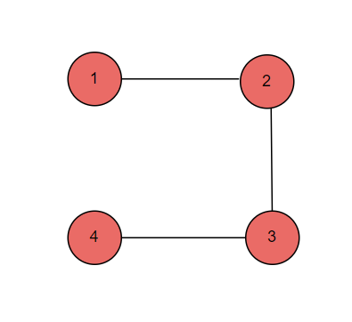
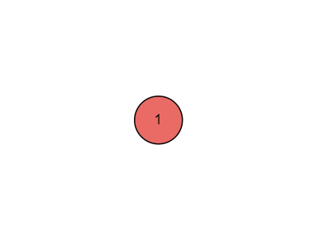

**Problem statement:**
Given a node in a connected undirected graph, return a deep copy of the graph. 

Each node in the graph contains an integer value and a list of its neighbors as shown below.

```js
class Node {
    public int val;
    public List<Node> neighbors;
}
```

The graph is represented as an adjacency list in the examples. An adjacency list is a mapping of nodes to lists to represent a finite graph. Each list describes the set of neighbors of a node in the graph.

For simplicity, nodes values are numbered from `1` to `n`, where `n` is the total number of nodes in the graph. The index of each node within the adjacency list is the same as the node's value (1-indexed). The input node will always be the first node in the graph and have 1 as the value.

## Examples:
Example1:

Input: adjList = [[2],[1,3],[2,4]]

Output: [[2],[1,3],[2,4]]



Example2:

Input: root = [[]]
Output: [[]]



Example3:

Input: root = []
Output: []

**Algorithmic Steps**
This problem is solved by Depth-First-Search(DFS) using recursion. The algorithmic approach can be summarized as follows: 

1. Create a node class(`Node`) with it's value and neighghbours as their properties.
   
2. Create a clone graph class(`CloneGraph`) with an empty visited nodes map(`visitedMap`) which stores the node value as key and cloned node as its value. This is helpful to keep track of all the nodes which have already been copied.
   
3. Create a clone graph function(`cloneGraph`) which accepts first node(`node`) as its input parameters
   
4. Implement an edge case returing `null` if the node is equals to null.

5. If the node already exists in an visited list, return the node from the list itself.
6. Otherwise, copy the node value from original node and store in a cloned node. Thereafter, the cloned node can be updated in visited nodes list.
7. Iteratve over all the neighbours of original node and update the neighbours list of cloned node with their respective cloned nodes using a dfs function.
8. Return the cloned node.

**Time and Space complexity:**
This algorithm has a time complexity of `O(V+E)`, where `V` is the number of nodes in graph and `E` is the number of edges. This is because each node is visited exactly once during the clone operation results in `V` time complexity. While visiting each node, all of its neighbors are iterated through to clone their nodes, contributing to `M` time complexity. Hence, the overall time complexity is `O(V+E)`.

The `cloneGraph` function requires `O(V)` space complexity, where `V` is the number of nodes in the graph. This is because the visited list is used to store and keep track of already visited/cloned nodes. It can contain atmost all the nodes of a graph. Also, the recursion stack  requires `O(V)` space complexity incase of deep graph.
