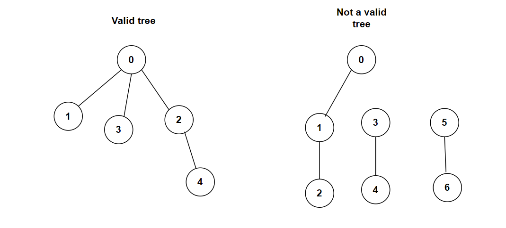

**Problem statement:**
Given `n` nodes labeled from `0` to `n - 1` and a list of undirected edges (each edge is a pair of nodes)`edges`. Determine whether these edges make up a valid tree or not. 

**Note:** Assume that no duplicate edges will exist in edges. All edges are undirected, [0, 2] is the same as [2, 0]. That means, both these edges will not appear together.

## Examples:
Example1:

Input: n=5 edges=[[0, 1], [0, 2], [0, 3], [2, 4]]

Output:
true

Example2:

Input: n=7 edges=[[0, 1], [1, 2], [3, 4], [5, 6]]

Output:
false

**Algorithmic Steps**
This problem is solved by Union-Find algorithm (also known as Disjoint Set Union or DSU). Here, the main intuition behind this problem is keeping track of elements which are split into one or more disjoint sets using **find** and **union** primary operations. The find operation is used to determine the representative of the set containing a particular element and union is used to merge the distinct sets. The algorithmic approach can be summarized as follows: 

1. Create a class(`GraphValidTree`) with parent and ranking arrays to represent the root parent of each node and ranking respectively. By default, they are initialized to empty arrays.
   
2. Create a function(`validTree`) to determine the given graph is valid tree or not. It accepts `n` as number of nodes and  `edges` as node pairs which are connected.

3. Initially each node is its own parent, the parents array is updated with list of node values starting from `0` to `n-1`. These nodes will ranking 1 because of no separate parent node.
   
4. Iterate over each edge and perform a union(or merge) operation on them. Before merging the sets, first you need to find the root nodes.

5. Create a find function(`find`) which accepts the given node to find its root parent. It uses path compression optimization to reduce the height of trees. This is helpful to flatten the paths during the next subsequent find operations. i.e, connecting the looked-up node point directly to the root node.
   
6. Create a union function(`union`) by accepting the vertices of each edge. Initially, this function derives the root nodes by calling the find function of previous step.
   
7. If the root nodes are equal, return `0` indicating that union is not required. Because those nodes are already connected.
   
8. Otherwise, compare the rankings of each nodes and assign the small element group to the deeper group. Also, update the rankings of deeper group.
   
9. Thereafter, return `1` indicating that two group can be merged as one large group.
   
10. For each successful union operation, reduce the initial disjoint groups count by one. After the iteration completes, return a boolean condition `count == 1` indicating the valid tree in a graph.

**Time and Space complexity:**
This algorithm has a time complexity of `O(E logV))`, where `V` represents total number of vertices in the graph and `E` is  total number of edges in the given graph. This is because each union and find operation takes `(O(logV))` time complexity due to the optimizations from both union by rank and path compression techniques. Since it has to be repeated for `E` edges, the overall complexity will be `O(E logV))`.

**Note:** Usually `logV` grows very slowly and it can be considered almost constant.

It requires `O(V)` space complexity, where `V` represents total number of vertices in the graph. This is required to store parent array of given vertices and rankings of them(`O(2V) ~O(V)`).
