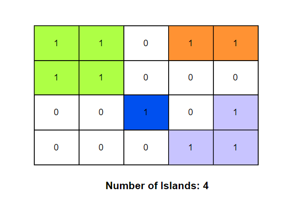

**Problem statement:**
Given a `m*n` 2D binary grid `grid` where '1' represents land and '0' represents water, count and return the number of islands.

An island is represented by connecting adjacent lands horizontally or vertically(i.e,no diagonal connection) and is surrounded by water. 

**Note:** You may assume all four sides/edges of the grid are surrounded by water.

## Examples:
Input: grid = [
    ["0","1","1","1","0"],
    ["0","1","0","1","0"],
    ["0","1","0","1","0"],
    ["0","1","0","0","0"]
  ]
Output: 1

Example2:

Input: grid = [    
    ['1','1','0','1','1'],
    ['1','1','0','0','0'],
    ['0','0','1','0','1'],
    ['0','0','0','1','1']]

Output: 4

**Algorithmic Steps**
This problem is solved by DFS using recursion to find the number of islands in the grid. Here, the main intuition behind this problem is exploring each land cell and marking all its connected cells recursively until all lands forming up an island have been visited. The algorithmic approach can be summarized as follows: 

1. Create a function(`numIslands1`) to determine the number of islands in the grid. It accepts `m*n` matrix `grid` as input parameter.
   
2. Calculate the total rows and cols of given grid and store them in `rows` and `cols` variables respectively.

3. The total number of islands is stored in  `islandsCount` variable. By default, it is initialized to 0.
   
4. Create a dfs function(`dfs`) to traverse each cell of the grid and its neighbours.
   
   1. This function accepts grid, current row and current column as input parameters.
   2. Return immediately either if the cell co-ordinates are not with in grid boundaries or already visited.
   3. Otherwise, recursively invoke dfs function in all the four directions(top, bottom, left and right) of the current cell.
   
5. Iterate over each cell in the grid, if the cell value is equals to `1` then invoke the dfs function along with updating the islands count.
   
6.  Return `islandsCount` as number of islands exists in the given grid.

**Time and Space complexity:**
This algorithm has a time complexity of `O(rows * cols)`, where `rows` is the number of rows in in the island and `cols` is the number of columns in the island. This is because each cell is visited exactly once during the dfs traversal using a recursion stack.

The `numIslands1` function requires `O(rows * cols)` space complexity, where `rows` is the number of rows in in the island and `cols` is the number of columns in the island. This is because when the entire grid is filled with lands(`1`), the call stack will grow to the number of cells in the grid. 
