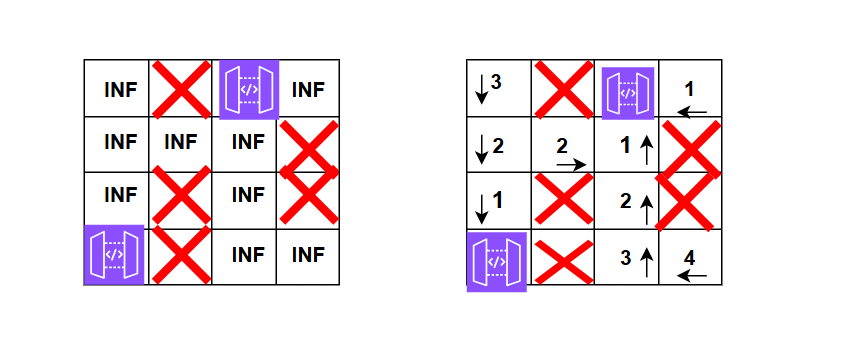

**Problem statement:**
Given a m x n 2D grid initialized with these three possible values.

1. -1 - A wall or an obstacle.
2.  0 - A gate.
3. INF - Infinity means an empty room. We use the value 2^31 - 1 = 2147483647 to represent INF as you may assume that the distance to a gate is less than 2147483647.

Fill each empty room with the distance to its nearest gate. If it is not possible to reach a gate, it should be filled with INF.

**Note:** It is possible to traverse in all four directions(top, left, right and bottom).

## Examples:
Example1:

Input: grid= [
        [INF,  -1,  0,  INF],
        [INF, INF, INF,  -1],
        [INF,  -1, INF,  -1],
        [0,   -1,   INF, INF]
]

Output: [
    [3,-1,0,1],
    [2,2,1,-1],
    [1,-1,2,-1],
    [0,-1,3,4]
]

Example2:

Input:  grid= [
        [-1,  0],
        [INF, INF]
]

Output:[
        [-1,  0],
        [2, 1]
]

**Algorithmic Steps**
This problem is solved by BFS(Breadth First Search) pattern to propagate the distance from each gate to all reachable empty rooms. The algorithmic approach can be summarized as follows: 

1. Define a constant named `INF`(i.e, infinity) to indicate empty rooms in the grid. During BFS traversal, these cells needs to be updated with distance from gates.
   
2. Create an empty BFS queue to traverse the grid and add all gate position to the queue.
   
3. Define the directions array(i.e, `directions`) to represent four possible movements for any cell.
   
4. Perform BFS traversal until the queue is not empty.
   1. Pop a cell from the front of a queue. The cell contains the co-ordinates of the cell position in grid.
   2. Iterate over all the four directions of a popped cell.
   3. If the new cell is situated at out of grid boundaries or not an empty room, proceed with next cell.
   4. Otherwise, add the empty cell to the queue. Also, update the distance of a new cell by incrementing 1 to the previous cell's value.

5. After completing the BFS traversal, the grid is updated in-place with distances from nearest gate.

**Time and Space complexity:**
This algorithm has a time complexity of `O(m * n))`, where `m` represents the number of rows in a grid and `n` is   number of column in the given grid. This is because each cell or node is processed at most once with the BFS traversal.

It requires `O(m * n)` space complexity. This is required for queue used in BFS traversal. In the worst case, the queue may store all the cells present in the grid.
