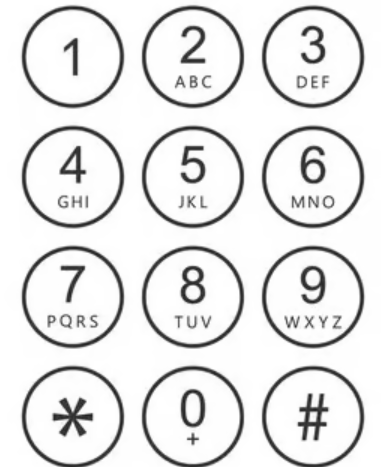
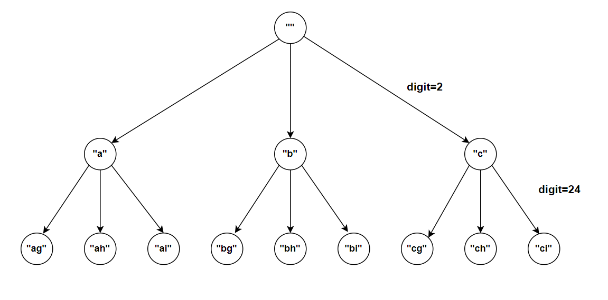

**Problem statement:**
Given a string `digits` contain digits 2-9 inclusive, and each digit(except 1) is mapped to a set of characters. Return all possible letter combinations that the number could represent. 

**Note:** The output can be written in any order. The mapping of digits to letters is shown below:

## Examples:
Example 1:

Input: digits = "24"

Output: ["ag","ah","ai","bg","bh","bi","cg","ch","ci"]

Example 2: 

Input: digits = ""

Output: []

**Algorithmic Steps**
This problem is solved with the help of backtracking recursive solution by generating all possible combinations of letters for respective digits. The mapping between digits(2-9) and letters is taken care by map datastructure. The algorithmic approach can be summarized as follows: 

1. Initialize an empty array `combinations` to store the final letter combinations.
    
2. Handle the edge case by returning empty combinations array if the given string `digits` is empty.
   
3. Create a digit(2-9) to character mapping using a map called `digitToChar`. 

4. Create a backtracking function to generate letter combinations for given digits string.
   1. Add a base case to include letter combination for given string. i.e If the length of digits string is equals to current string(`digits`), add that current string to `combinations` and return.
   2. Iterate over all possible letters of a current digit. For each iteration, recursively call backtracking function with incremented index(`i+1`) and updated current string(`currStr`).
   3. Continue this process until all possible combinations added.
   
5. Invoke the backtracking function with in main function. The function is called with index 0 and empty current string.
   
6. Return `combinations` indicating the possible combinations of digits string.
   

**Time and Space complexity:**
This algorithm has a time complexity of `O(4^n)`, Where `n` is the number of digits in a given string. This is because the backtrack function needs to generate all possible combinations of letters. For each digit, there are upto 4 possible characters(for example, 7-> "pqrs" and 9->"wxyz"). If there are `n` digits in a given string, the maximum number of possible combinations is `O(4^n)`. Building each combination involves appending character one by one, and each combination takes `O(n)`. Hence, the overall time complexity ois `O(n * 4^n)`.

Here, the maximum possible combinations of letters are `4^n` ,and each combination has a length of `n`. So it takes a space complexity of `O(n * 4^n)`.
