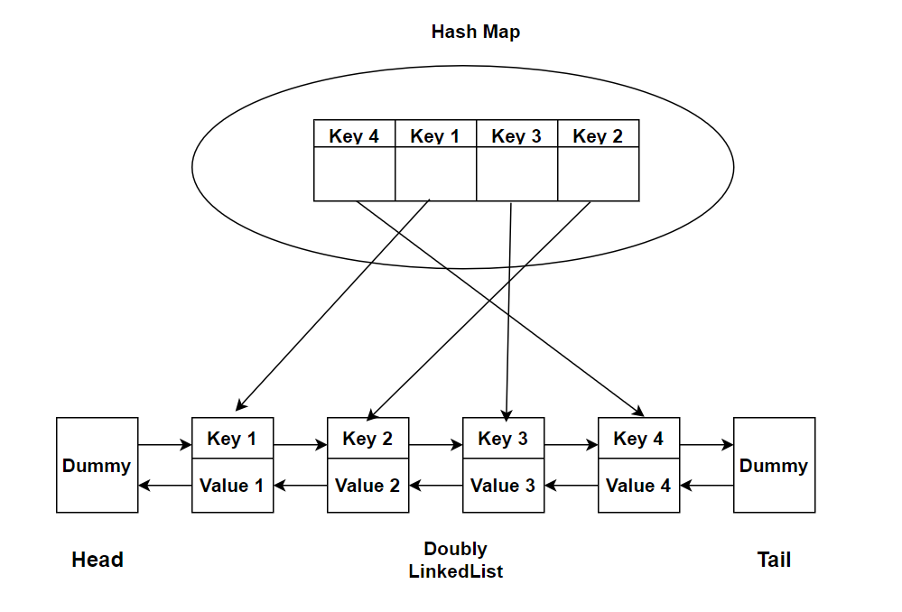

**Problem statement:**
Implement the **Least Recently Used (LRU) cache** class `LRUCache` with the following operations,
 1. `LRUCache(int capacity)` Initialize the LRU cache of positive size `capacity`.
 2. `int get(int key)` Return the value of the `key` if the `key` exists, otherwise return -1.
 3. `void put(int key, int value)` Update the value of the `key` if the `key` exists. Otherwise, add the key-value pair to the cache. If the addition of the new key-value pair causes the cache to exceed its capacity, remove the least recently used key.
 

**Note:** Each `get` and `put` needs to run in `O(1)` average time complexity.

## Examples:
Example 1:

Input:
["LRUCache", [2], "put", [1, 5],  "get", [1], "put", [2, 10], "put", [3, 15], "get", [2], "put", [4,20], "get", [1]]

Output:
[null, null, 5, null, null, 10, null, null, -1]

Explanation:
LRUCache lRUCache = new LRUCache(2);
lRUCache.put(1, 5);  // cache: {1=5}
lRUCache.get(1);      // return 5
lRUCache.put(2, 10);  // cache: {1=5, 2=10}
lRUCache.put(3, 15);  // cache: {2=10, 3=15}, key=1 was evicted
lRUCache.get(2);      // returns 10 
lRUCache.put(4, 20);  // cache: {3=15, 4=20}, key=2 was evicted
lRUCache.get(1);      // return -1 (not found)

**Algorithmic Steps**
This problem is solved with the help of constant time lookups through hash map and ordered structured of doubly linked list data strcture. The hash map can provide get and put operations with `O(1)` time complexity, which is essential for LRU cache system. The algorithmic approach can be summarized as follows: 

1. Create a node class(`Node`) to represent each entry in the cache. Each node will have a key, value, and pointers to the previous and next node.
   
2. Create a `LRUCache` class to manage the nodes and implementing the LRU Cache mechanism. 
   
3. The LRUCache class contains capacity of cache, cache hash map, and two dummy pointers named as head and tail nodes.
    
4. Initially head and tail nodes connected each other without any real nodes in between them. 
   
5. Create two internal methods `_remove` and `_insert` to use them with in get and set operations of LRU Cache. The remove method deletes the node from the doubly linked list. Whereas insert method is used to add a new node next to the head node. 

6. Implement `get` method to fetch the node value from LRU cache. If the given key exists in cache, return the node value and increase the priority of the data in the LRU cache. Otherwise, return -1.
   
7. Implement `set` method to add key-value pair as an entry inside LRU cache. If the given key already exists in cache, update its value in the cache. Otherwise, add a key-value pair to the cache. Incase the number of keys exceeds the capacity of the LRU cache, evict the least recently used data.   

**Time and Space complexity:**
This algorithm has a time complexity of `O(1)` for both get and set methods. This is because accessing an item from hash map and updating its position in doubly linked list takes `O(1)` time complexity. In the same way, inserting an item inside hash map and adjusting the double linked list requires `O(1)` time complexity.

Here, both hash map and double linked list requires `O(n)` space to store all the items in cache, where `n` is the capacity of cache.
