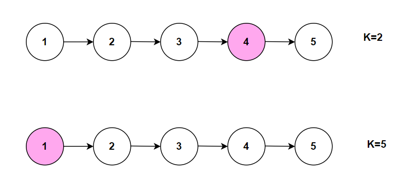

**Problem statement:**
Given the `head` of a linked list. Find the `K`th node value from the end of the linkedlist.

## Examples:
Example 1:

Input: head = [1,2,3,4,5], k=2
Output: 4

Example 2: 

Input: head = [1,2,3,4,5], k=5
Output: 1

## Pictorial representation

 

**Algorithmic Steps**
This problem is solved with the help of two pointers approach. The algorithmic approach can be summarized as follows: 

1. Accept the `k`th index of the linkedlist as input parameter.
   
2. Create two pointers named `first` and `second` to traverse the list.Both are initialized to `head` node.

3. Loop over the list until iteration index is less than `k`.

4. In each iteration, update the first pointer to it's next node.
   
5. Loop over the list until first pointer is not equal to null and update both first & second pointers to their next nodes.
   
6. At the end of the loop, the second pointer is situated at Kth node from end of the list.

7. Return `second` pointer as the required node's value.

**Time and Space complexity:**
This algorithm takes a time complexity of `O(n)`, where  `n` is the number of nodes in the list `head` . This is because first pointer needs to traverse at most once to the required node's value.

Here, we don't use any additional datastructure other than few pointer variables. Hence, the space complexity will be `O(1)`.
