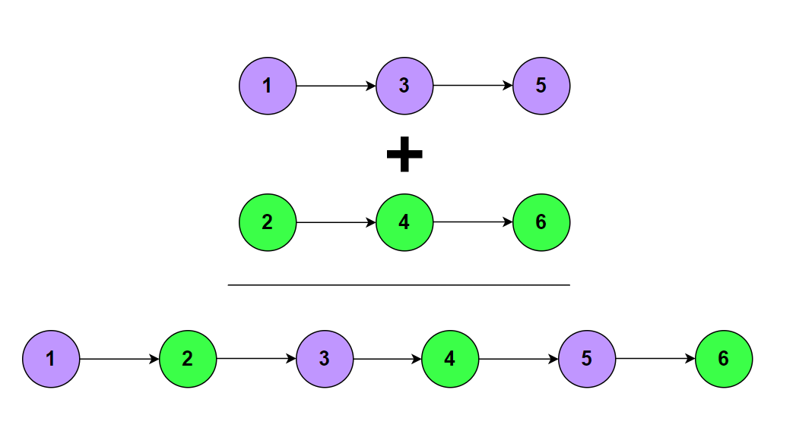

**Problem statement:**
Given the heads of two sorted linked lists `l1` and `l2`. Merge the two lists into one sorted linked list and return the head of the newly created sorted linked list.

**Note:** The merged linked list should be constructed by connecting the nodes from the two lists directly.

## Examples:
Example 1:

Input: l1 = [1,3,5], l2 = [2,4,6]
Output: [1,2,3,4,5,6]

Example 2:

Input: l1 = [10,20,30], l2 = [5,15,25,35,45]
Output: [5,10,15,20,25,30,35,45]]

Example 3: 

Input: l1 = [], l2 = []
Output: []

## Pictorial representation

 

**Algorithmic Steps**
This problem is solved by comparing the values of both the lists and add the lower node to the merged list until atleast one of the list is exhausted. The algorithmic approach can be summarized as follows: 

1. Accept the head nodes of two linked lsits(i.e, `l1` & `l2`).
   
2. Create a `dummyNewHead` to act as the head of merged list.

3. Create `current` pointer to add the nodes from both lists. Initially, it is pointed to dummy node.

4. Loop over the lists until both nodes are not null.

5. If `l1` value is less than `l2`, add it as next node for `current` pointer. Also, update the `l1` pointing to next node of its list.

6. Otherwise(i.e, If `l2` value is less than or equal to `l1`, add it as next node for `current` pointer. Also, update the `l2` pointing to next node of its list.
   
7.  For each iteration, update the current pointer to it's next node.

8. If any one of the lists has remaining elements, add them to the end of current pointer.

9. Return the next node of dummy node as new head of the merged list.

**Time and Space complexity:**
This algorithm takes a time complexity of `O(m+n)`, where `m` and `n` are the lengths of `l1` and `l2` respectively. This is because we need to traverse both the lists in a worst case. 

Here, we don't use any additional datastructure other than `dummyNewHead` and `current` pointers. Hence, the space complexity will be `O(1)`.
