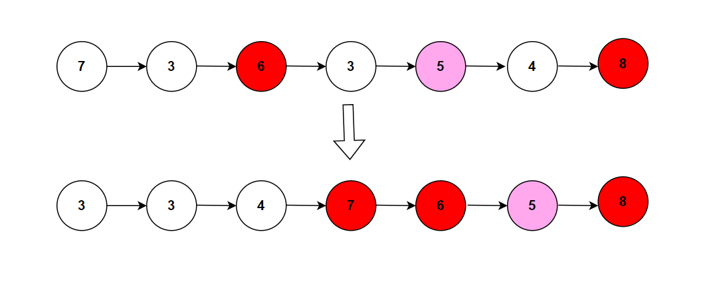

**Problem statement:**
Given the `head` of a linked list and an integer value `x`. You need to partition the nodes in the linked list in such a way that all nodes having values less than `x` are placed before the nodes with values greater than or equal to `x`.

**Note:** You need to preserve the original relative order of the nodes in these two partitions.

## Examples:
Example 1:

Input: head = [7,3,6,3,5,4,8], k=5
Output: [3,3,4,7,6,5,8]

Example 2: 

Input: head = [3,2], k=3
Output: [2,3]

## Pictorial representation

 

**Algorithmic Steps**
This problem is solved with the help of two pointers approach along with dummy nodes usage. The main intuition of this problem is partition the linked list around a specific value `x`, such that all nodes less than `x` come before nodes greater than or equal to `x`. The algorithmic approach can be summarized as follows: 

1. Accept an integer value `x`, which is used to partition the list.
   
2. Create two dummy nodes named `leftDummy` and `rightDummy` to represent the temporary heads of the two partitions.

3. Create two tail pointers(`leftTail` and `rightTail`) to represent the tail nodes of both partitions. These pointers are helpful to connect new nodes in the partitions.

4. Initialize a current pointer(`current`) with head of the original list.
   
5. Loop over the original list until the current pointer is not null.

6. In each iteration, check the current node value is less than `x` or not. If it is less than, add it to the left partition. Otherwise add it to the right partition. Upon adding the node, the current node needs to be moved to next node.
   
7. Connect the tail of the left partition to the first node(next to the dummy node) of right partition. 

8. Set the next pointer of the right partition's tail node to null. This is required to create a tail node of the newly merged list.
   
8. Return the next node of `leftDummy` to represent the head of newly merged list.

**Time and Space complexity:**
This algorithm takes a time complexity of `O(n)`, where  `n` is the number of nodes in the list. This is because we needs to traverse at most once to update the original list.

Here, we don't use any additional datastructure other than few pointer variables. Hence, the space complexity will be `O(1)`.
