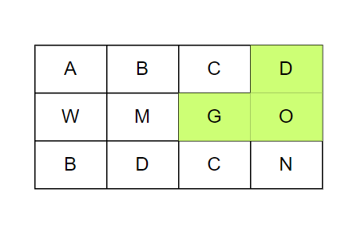
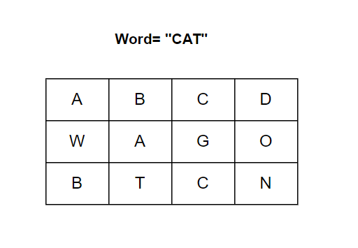

**Problem statement:**
Given an `m x n` 2-D grid of characters `board`, return `true` if the word exists in the grid, otherwise return `false`.

The word can be formed from letters  which are horizontally or vertically neighboring cells in the board. The same cell may not be used more than once.

## Examples:
Example1:

Input: 
board = [
  ["A","B","C","D"],
  ["W","M","G","O"],
  ["B","D","C","N"]
],
word = "DOG"

Output: true

Example2:

Input: 
board = [
  ["A","B","C","D"],
  ["W","A","G","O"],
  ["B","T","C","N"]
],
word = "CAT"

Output: false

**Algorithmic Steps**
This problem is solved by Depth-First Search (DFS) using recursion, which allows us to explore all potential paths from a given cell to form the word. The algorithmic approach can be summarized as follows: 

1. Create a function(`isWordExist`) by accepting the `m*n` matrix as input parameter.
   
2. Calculate dimensions `rows` and `cols` for traversing the square matrix.
   
3. Create a DFS function by passing element co-ordinates and current index of word.
   1. Add a first base check, returning `true` if the length of word is equals to word's index.
   2. Add a second base check to verify out of boundary conditions, letter's equality and element already visisted or not. If any of those conditions satisfy, return `false` indicating given word doesn't exist
   3. Mark the currently visited cells with `*` and reset it at the end.
   4. Perform dfs function in all four directions of current cell and return `true` if any of them forms a word.

4. Iterate over each cell of the matrix and invoke recursive DFS function. The return value of dfs function determine whether given word exists or not.

5. After completing step4, return `false` if the given word doesn't found in the board.
   
**Time and Space complexity:**
This algorithm has a time complexity of `O(m * n * 4^L)`, where ``m` is the number of rows, `n` is the number of columns, and `L` is the length of the word. This is because each element needs to visted once and four neighbouring directions.

It requires `O(L)`,where `L` is the length of the word. constant space complexity irrespective of the matrix size. This is due to recursion stack used during Depth-First Search (DFS).
