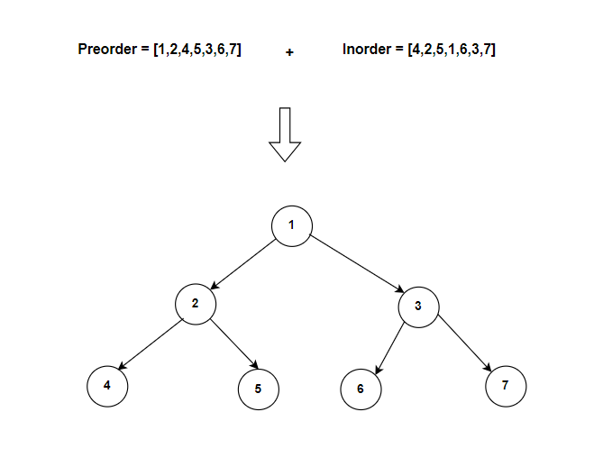

**Problem statement:**
Given two integer arrays `preorder` and `inorder`, where preorder is the preorder traversal of a binary tree and inorder is the inorder traversal of the same tree. Rebuild the binary tree from these two arrays and return the binary tree.

**Note:** Both arrays are of the same size and contains unique values.

## Examples:
Example1:

Input: preorder = [1,2,4,5,3,6,7], inorder = [4,2,5,1,6,3,7]
Output: [1,2,3,4,5,6,7]

Example2:

Input: preorder = [2], inorder = [2]
Output: [2]

**Algorithmic Steps**
This problem is solved by Depth-First-Search(DFS) using recursion. The algorithmic approach can be summarized as follows: 

1. Create a recursive DFS function(`buildTree`) which accepts preorder `preorder` and inorder `inorder` traversal arrays as inputs. 

2. Add a base case check, returning `null` if either of the trees length is zero.

3. The first element of preorder traversal is always a root node. So, create a root node(`root`) based on current traversal arrays.
   
4. The index of previous root element within inorder traversal array provides the middle index(`mid`) of left and right partitions. i.e, The left side partition of mid element provides left subtree and right side partition with right subtree.

5. Construct the left subtree by recursively calling DFS function `buildTree` using preorder sublist(i.e, `1 -> mid+1`) and inorder sublist(i.e, `0 -> mid`).
6. Construct the right subtree by recursively calling DFS function `buildTree` using preorder sublist(i.e, `mid+1 -> length`) and inorder sublist(i.e, `mid+1 -> length`).
   
7. Return root node `root` indicating the binary tree.

**Time and Space complexity:**
This algorithm has a time complexity of `O(n)`, where `n` is the number of nodes in either of the binary trees. This is because we are traversing both preorder and inorder arrays exactly once. 

It requires a space complexity of `O(n)` because call stack requires at most length of `n`.
