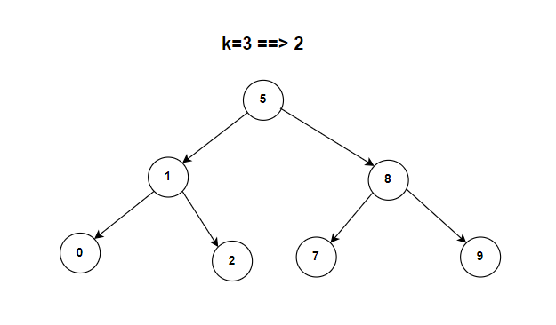

**Problem statement:**
Given the `root` of a binary search tree, and an integer `k`, return the `k`th smallest value (1-indexed) in the tree.

A valid BST follows the below constraints:

1. The left subtree of every node contains only nodes with keys less than the node's key.
2. The right subtree of every node contains only nodes with keys greater than the node's key.
3. Both the left and right subtrees must also be binary search trees.

## Examples:
Example1:

Input: root = [5,1,8,0,2,7,9], k=3
Output: 2

Example2:

Input: root = [2,1,3], k=2
Output: 2

**Algorithmic Steps**
This problem is solved by iterative inorder traversal using stack. The algorithmic approach can be summarized as follows: 

1. Create a function(`kthSmallestBST`) to find the kth smallest element in the binary search tree. It accepts root node and an integer index as input parameters. 

2. Create an array based empty stack(`stack`) to hold the tree nodes. Also, assign the root node to current node(`currNode`) for traversal.
   
3. Iterate over the BST nodes until either the current node is not null or stack is empty.
   
   1. Visit all the left most nodes and add them to a stack using a nested while loop.
   2. Once the left most node is reached, process the last node by popping out the node from stack.
   3. Decrement the index `k` as the node is processed.
   4. Return the current node's value if the index is equals to 0.
   5. Move the current node to right subtree as per inorder traversal.

4. Since index `k` exists between the range of nodes, the outloop exits once the index is equals to zero. To cover the usecase of invalid index `k`, return `0` at the end.

**Time and Space complexity:**
This algorithm has a time complexity of `O(n)`, where `n` is the number of nodes in the binary tree. This is because each node is visited atmost once to find kth smallest element. 

It requires a space complexity of `O(n)` because stack can hold maximum of `n` nodes(skewed tree).
