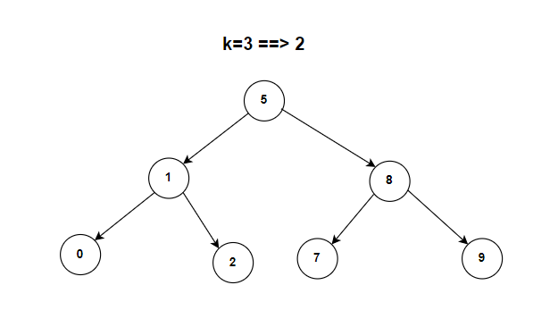

**Problem statement:**
Given the `root` of a binary search tree, and an integer `k`, return the `k`th smallest value (1-indexed) in the tree.

A valid BST follows the below constraints:

1. The left subtree of every node contains only nodes with keys less than the node's key.
2. The right subtree of every node contains only nodes with keys greater than the node's key.
3. Both the left and right subtrees must also be binary search trees.

## Examples:
Example1:

Input: root = [5,1,8,0,2,7,9], k=3
Output: 2

Example2:

Input: root = [2,1,3], k=2
Output: 2

## Approaches

### 1. Iterative Inorder with Stack (`kthSmallest1`) — TC: O(h+k), SC: O(n)

1. Initialize an empty stack and set `currNode = root`.
2. Outer loop: continue while `currNode != null` or stack is not empty.
3. Inner loop: push all left-side nodes onto the stack until `currNode` is `null`.
4. Pop a node from the stack and decrement `k`.
5. If `k == 0`, return the node's value — it is the k-th smallest.
6. Move `currNode` to the right child and repeat.

### 2. Recursive Inorder (`kthSmallest2`) — TC: O(n), SC: O(h)

1. Perform an inorder traversal (left → root → right).
2. Maintain a `count` variable incremented at each visited node.
3. When `count == k`, store the current node's value in `result` and return.
4. Return `result` after traversal.

**Time and Space complexity:**
- Iterative: `O(h+k)` time (traverses at most h left edges plus k nodes), `O(n)` space (stack).
- Recursive: `O(n)` time (visits all nodes in the worst case), `O(h)` space (call stack).
