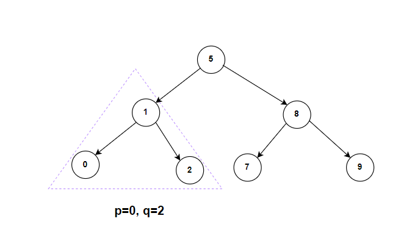

**Problem statement:**
Given the `root` of a binary search tree (BST) where all node values are unique, and two nodes from the tree `p` and `q`, return the lowest common ancestor (LCA) of the two nodes.

The lowest common ancestor between two nodes `p` and `q` is the lowest node in a BST such that both `p` and `q` as descendants. 

**Note:** Each node is allowed to be a descendant of itself.

## Examples:
Example1:

Input: root = [5,1,8,0,2,7,9], p=0, q=2
Output: 1

Example2:

Input: root = [5,1,8,0,2,7,9], p=8, q=9
Output: 2

## Approaches

### 1. Iterative BST (`lowestCommonAncestorBST1`) — TC: O(h), SC: O(1)

1. Start at `curr = root`.
2. While `curr != null`:
   - If both `p.value` and `q.value` are less than `curr.value`, move left.
   - If both are greater than `curr.value`, move right.
   - Otherwise (split point), `curr` is the LCA — return it.
3. Return `null` if no LCA found.

### 2. Recursive BST (`lowestCommonAncestorBST2`) — TC: O(h), SC: O(h)

1. If both `p.value` and `q.value` are less than `root.value`, recurse into the left subtree.
2. If both are greater than `root.value`, recurse into the right subtree.
3. Otherwise, `root` is the split point — return it as the LCA.

**Time and Space complexity:**
Both approaches visit at most one node per level, giving `O(h)` time. The iterative approach uses `O(1)` space; the recursive approach uses `O(h)` call stack space. In a balanced BST `h = O(log n)`; in a skewed tree `h = O(n)`.
