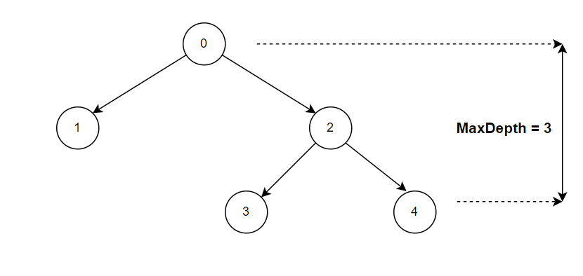

**Problem statement:**
Given the `root` node of a binary tree, return its maximum depth.

The maximum depth of a binary tree is defined as the number of nodes along the longest path from the root node down to the farthest leaf node.

## Examples:
Example1:

Input: root = [0,1,2,null,null,3,4]
Output: 3

Example2:

Input: root = [0, null, 1]
Output: 2

**Algorithmic Steps**
This problem is solved by Depth-First-Search(DFS) recursive traversal. The algorithmic approach can be summarized as follows: 

1. Add an edge case returing 0 for empty root node.

2. If root is not null, include root's depth as 1 to the sum of maximum depth between left subtree and right subtree.

3. Return the calculated value from step2 as maximum depth of binary tree.

**Time and Space complexity:**
This algorithm has a time complexity of `O(n)`, where `n` is the number of nodes in tree. This is because the algorithm visits each node exactly once to calculate the maximum depth. 

When the tree is unbalanced, all the nodes appear on one side. In this case, the recursive call stack requires `O(n)` to calculate the maximum depth . Hence, the space complexity will be `O(n)`.
