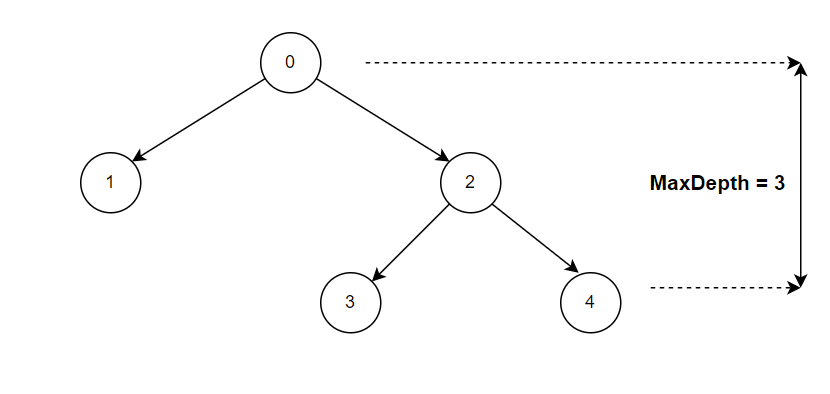

**Problem statement:**
Given the `root` node of a binary tree, return its maximum depth.

The maximum depth of a binary tree is defined as the number of nodes along the longest path from the root node down to the farthest leaf node.

## Examples:
Example1:

Input: root = [0,1,2,null,null,3,4]
Output: 3

Example2:

Input: root = [0, null, 1]
Output: 2

## Approaches

### 1. Recursive DFS — Post-Order (`maxDepth1`) — TC: O(n), SC: O(h)

1. Return `0` if root is `null` (base case).
2. Recursively compute the max depth of the left and right subtrees.
3. Return `1 + max(leftDepth, rightDepth)`.

### 2. Iterative DFS — Pre-Order with Stack (`maxDepth2`) — TC: O(n), SC: O(h)

1. Return `0` if root is `null`.
2. Push `(root, depth=1)` onto a stack. Initialize `maxDepth = 0`.
3. While the stack is not empty, pop a `(node, depth)` pair and update `maxDepth`.
4. Push left child with `depth+1` and right child with `depth+1` if they exist.
5. Return `maxDepth`.

### 3. BFS — Level-Order (`maxDepth3`) — TC: O(n), SC: O(n)

1. Return `0` if root is `null`.
2. Enqueue `root`. Initialize `maxDepth = 0`.
3. While the queue is not empty, process all nodes at the current level (one full for-loop pass).
4. Enqueue non-null children of each processed node.
5. Increment `maxDepth` after each level completes.
6. Return `maxDepth`.

**Time and Space complexity:**
All three approaches visit every node exactly once, giving `O(n)` time. Space is `O(h)` (call stack / explicit stack) for DFS approaches, and `O(n)` for BFS (queue can hold an entire level).
