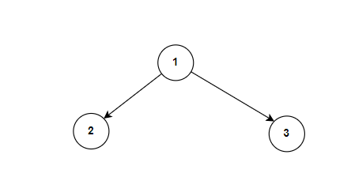
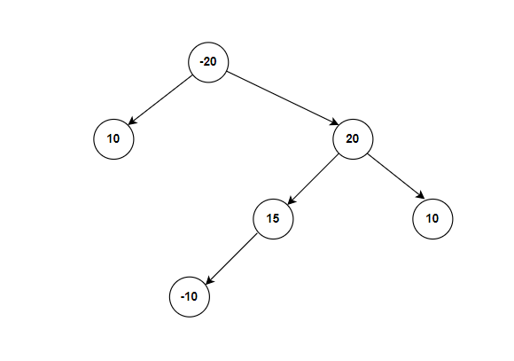

**Problem statement:**
Given the `root` of a binary tree, return the maximum path sum of any non-empty path.

A **path** in a binary tree is a sequence of nodes where each pair of adjacent nodes has an edge connecting them. A node can not appear in the sequence more than once. In this case, the path does not necessarily need to include the root.

The **path sum** of a path is the sum of the node's values in the path.

## Examples:
Example1:

Input: root = [1,2,3]
Output: 6

Example2:

Input: root = [-20,10,20,null,null,15,10,-10]
Output: 45

**Algorithmic Steps**
This problem is solved by swapping nodes and Depth First Search(DFS) with recursion over left and right substrees and calculate the path sums. The algorithmic approach can be summarized as follows: 

1. Create a dfs recursive function that takes a node of the binary tree and returns the maximum path sum calculated by including the current node and extending the recursion to either its left or right child. 
   
2. As part of this core dfs function, add base check by returning `0` if the tree node is null. This is because null node doesn't contribute to the path sum.

3. calculate the maximum path sum from the left child(i.e, `leftMax`) with a recursive dfs function. If the sum is negative, just ignore the contribution by considering 0 as its value.

4. calculate the maximum path sum from the right child(i.e, `leftMax`) with a recursive dfs function. If the sum is negative, just ignore the contribution by considering 0 as its value.
   
5. Calculate the global maximum sum(i.e, `maxPathSum`) with the greater value of current maximum sum and path sum at current node(i.e, sum of current node value, and its `leftMax` and `rightMax`). The global sum is initialized to lowest negative value to indicate that any path sum in the tree will be larger.

6. Since a path cannot have branches, return the max path sum from the dfs function by adding current node value with maximum of `leftMax` or `rightMax`.

7. Invoke the dfs function in a main function by passing the root node. This is the highest point in the tree where the recursion process starts. 
   
8. Return global max sum(`maxPathSum`) which represents the maximum path sum from any sequence of nodes in the given binary tree.

**Time and Space complexity:**
This algorithm has a time complexity of `O(n)`, where `n` is the number of nodes in the given tree. This is because DFS function visits each node of the tree exactly once. 

It requires a space complexity of `O(n)` because recursive calls generates a call stack size equal to the number of nodes in the skewed tree(i.e, each node with only one child).
