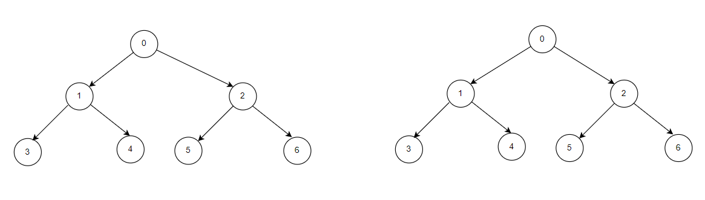
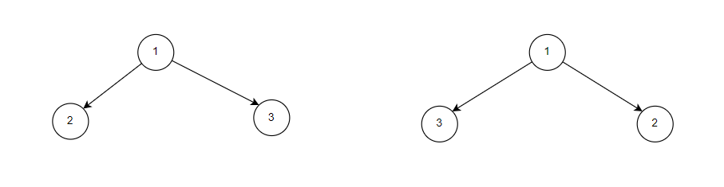

**Problem statement:**
Given the roots of two binary trees `a` and `b`, return `true` if the trees are equivalent, otherwise return `false`.

Any two binary trees are considered equivalent if they share the same structure and the nodes have the same values too.

## Examples:
Example 1:

Input: a = [0,1,2,3,4,5,6] b = [0,1,2,3,4,5,6]
Output: true



Example 2:

Input: a = [1,2,3] b = [1,3,2]
Output: false



## Approaches

### 1. Recursive DFS (`isSameTree`) — TC: O(n), SC: O(h)

1. Return `true` if both nodes are `null`.
2. Return `false` if one is `null`, or values differ.
3. Recursively check left and right subtrees.

### 2. Iterative DFS (`isSameTree1`) — TC: O(n), SC: O(h)

1. Push the pair `(p, q)` onto a stack.
2. Pop a pair; if both `null`, `continue`. If one is `null` or values differ, return `false`.
3. Push left children pair and right children pair.
4. Return `true` when the stack is empty.

### 3. BFS (`isSameTree2`) — TC: O(n), SC: O(w)

1. Enqueue `p` and `q` into a queue (interleaved pairs).
2. Poll two nodes; if both `null`, `continue`. If one is `null` or values differ, return `false`.
3. Enqueue all four children (nulls included so structure mismatches are detected).
4. Return `true` when the queue is empty.

## Test Examples

| # | Tree p | Tree q | Expected |
|---|--------|--------|----------|
| 1 | `[0,1,2,3,4,5,6]` | `[0,1,2,3,4,5,6]` | `true` |
| 2 | `[1,2,3]` | `[1,3,2]` | `false` |
| 3 | `[1,2]` | `[1,null,2]` | `false` |
| 4 | `null` | `null` | `true` |
| 5 | `[1,2,3,...]` | `null` | `false` |
| 6 | `[5]` | `[5]` | `true` |
| 7 | `[1]` | `[2]` | `false` |

```java
// Test 1: Identical full trees → true
isSameTree(root1, root2)   // root1 = root2 = [0,1,2,3,4,5,6]

// Test 2: Same structure, swapped children → false
isSameTree(root3, root4)   // root3=[1,2,3], root4=[1,3,2]

// Test 3: Different structure → false
isSameTree(root5, root6)   // root5=[1,2,null], root6=[1,null,2]

// Test 4: Both null → true
isSameTree(null, null)

// Test 5: One null → false
isSameTree(root1, null)

// Test 6: Single node, same value → true
isSameTree(new TreeNode(5), new TreeNode(5))

// Test 7: Single node, different value → false
isSameTree(new TreeNode(1), new TreeNode(2))
```

All test cases apply equally to `isSameTree1` (Iterative DFS) and `isSameTree2` (BFS).

**Time and Space complexity:**
This algorithm has a time complexity of `O(n)`, where `n` is the number of nodes in the smaller tree. This is because the function visits each node at most once.

Space complexity is `O(h)` for recursive and iterative DFS (h = tree height), and `O(w)` for BFS (w = maximum tree width).
