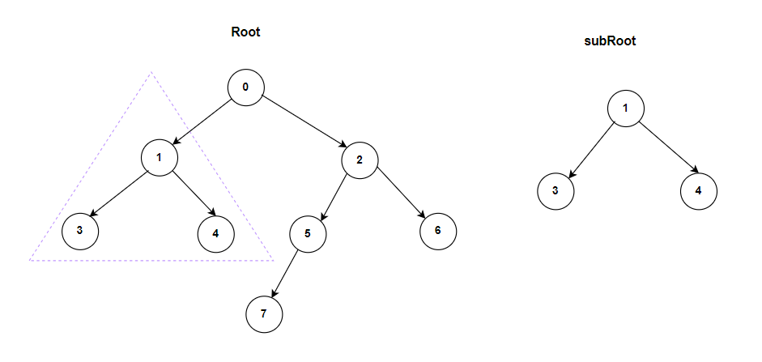
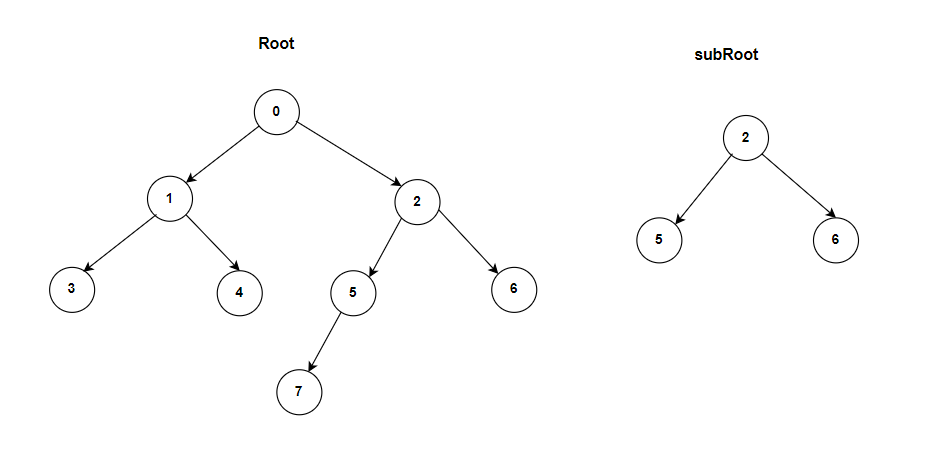

**Problem statement:**
Given the roots of two binary trees `root` and `subRoot`, return `true` if there is a subtree of `root` with the same structure and node values of `subRoot` and return `false` otherwise.

A subtree of a binary tree `tree` is a tree that consists of a node in tree and all of this node's descendants. You need to remember that tree `tree` could also be considered as a subtree of itself.

## Examples:
Example1:

Input: root = [0, 1, 2, 3, 4, 5, 6, 7], subRoot=[1,3,4]
Output: true

Example2:

Input: root = [0, 1, 2, 3, 4, 5, 6, 7], subRoot=[2,5,6]
Output: false

**Algorithmic Steps**
This problem is solved by Depth-First-Search(DFS) using recursion. The algorithmic approach can be summarized as follows: 

1. Create a subtree check function which accepts the `root` and `subRoot` as input an arguments. 

2. Add a base case check, returning `true` if the subRoot is null.

3. Add another base case check, returning `false` if the root is null and subRoot is not null.
   
4. Verify if both trees are same or not. Also, check `subRoot` verification on left and right branches of `root`. 

5. Create a same tree function(`isSameTree`) with root1 and root2 nodes as input parameters.
    1. If both `root1` and `root2` are equal to null, return `true` indicating that both trees are same.
    2. Otherwise, compare both node values are equal or not. If they are equal, recursively call `isSameTree` function with left and right branches.
   
6. If any of these conditions in **Step4** are true, return `true` indicating that `subRoot` is a subtree of `root` tree.

**Time and Space complexity:**
This algorithm has a time complexity of `O(m* n)`, where `m` is the number of nodes in the root tree and `n` is the number of nodes in the sub tree. This is because for each node of the root, we need perform a depth-first search (DFS) comparison with the subRoot. 

It requires a space complexity of `O(m)` because call stack requires at most length of `m`.
