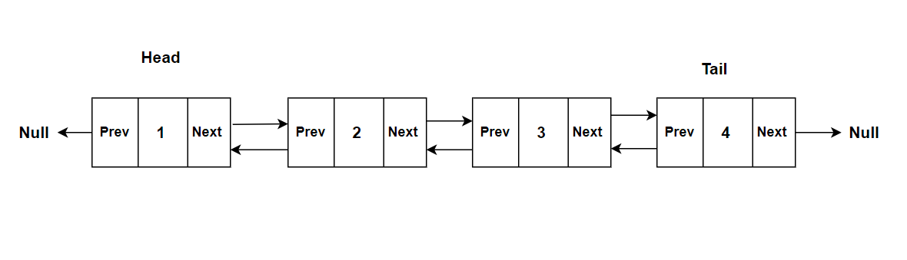

A doubly linked list is a one type of linked list in which each node contains value and two pointers, one pointing to the previous node and another pointing to the next node. Since it can traverse in both directions, it is suitable for frequent insertions and deletions.

The structure of single linked list looks like below,

   

The linked list can have the following functionalities,

1. **Push:** You can push a new node into the end of list. First, you need to create a new node using a given value. If the list is empty, assign the head and tail to the new node. Otherwise, the tail's next points to new node and new node's prev points to tail node. At last, current tail node assigned to new node as a new tail. Finally, increment the size of the list.

2. **Pop:** This action performs deleting the last element of list. If the list is empty, return undefined. The tail node which needs to be popped out stored in a temporary variable. If the list has one node, both head and tail updated to null. Otherwise, you can assign the tail node to previous node of tail node, set the next property of tail node to be null, and update the prev of tail pointer to null. At last, decrement the length of the list and return the temporary variable.
   
3. **Unshift:** This action is used to insert the element at first position. If the list is empty, update the head and tail pointers to newly created node. Otherwise, set the next property of new node to head node, prev property of head node to new node, and update the head node to newly added node. Similar to push, the size of the list needs to be incremented.
   
4. **Shift:** This action is used to delete the element at first position. If the list is empty, return undefined. Otherwise, update the head reference to current head's next node, next and previous pointers of old head to null, and decrement the length of the list. 
   
5. **Get:** Eventhough linked list doesn't support indexing, it is possible to fetch the node based on given index. First, return undefined if the length of the list is less than zero or greater than or equal to length of the list. Otherwise, loop through the list until you reach the index and return the respective node. Here, if the index is less than middle, the node is accessed through next property, otherwise, the node is accessed through prev property.
   
6. **Set:** This method is used to change a node in the linked list. First you need to get the node with `get()` method and update the node's data based on given input.
   
7. **Insert:** This method is used to insert a node at any position with in the list. At first, you need to verify the boundary conditions. If the index is less than zero or greater than the length of the list. If so, just return false. Incase, if the index is equal to the length, insert the node using `push()` operation, if the index is zero, add the node using `unshift()` method. In all other cases, get the node `index-1` position, and set the next property of that node to new node, and the next property of the new node to be the accessed node's next property. Also, update the previous pointers of new node and next node of accessed node to accessed node and new node respectively. At the end, increment the size of the list.
   
8.  **Remove:** This method is used to remove a node at any position with in the list. At first, you need to verify the boundary conditions. If the index is less than zero or greater than the length of the list. If so, just return `undefined`. Incase, if the index is equal to `length-1`, delete the node using `pop()` operation, if the index is zero, delete the node using `shift()` method. In all other cases, get the node at `index` position, and set the next property of that node to the next of the next property. Also, the previous pointer of indexed node's next node to the node before the indexed node. As a last step, decrement the size of the list.
   
9.  **Reverse:** This action is used to reverse the elements of a list. First, declare the next and prev nodes based on head node and reverse the references by looping through all the nodes. Thereafter, swap the head and tail nodes.

## Complexity

| Access            | Search             | Insertion | Deletion               | Space (Memory)    |
| :-------------: | :-----------------: | :-----------------: | :-------: | :-------: |
|  O(n)               | O(n)       | O(1)       | O(1)         | O(n)       | 