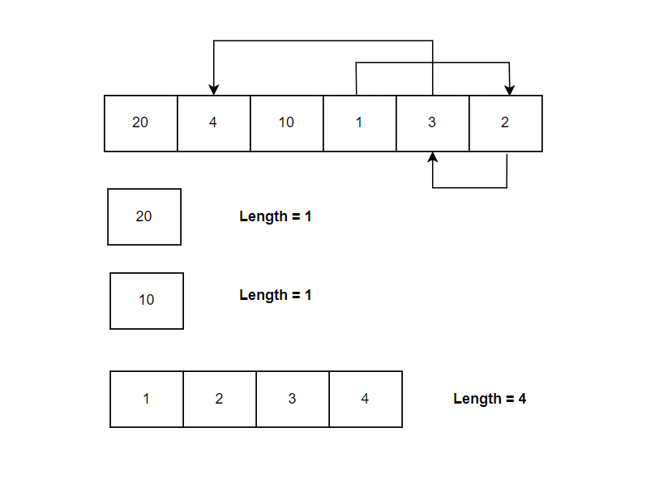

**Problem statement:**
Given an unsorted array of integers `nums`, return the length of the longest consecutive sequence of elements.

A consecutive sequence is a sequence of elements in which each element is greater than the previous element by 1. 

**Note:** The algorithm must run in `O(n)` time..

## Examples:
Example1:

Input: nums = [20, 4, 10, 1, 3, 2]
Output: 4
Explanation: The longest consecutive sequence is [1, 2, 3, 4].

Example2:

Input: nums = [7, 0, 6, 2, 3, 1, 5, 4]
Output: 8
Explanation: The longest consecutive sequence is [0, 1, 2, 3, 4, 5, 6, 7].

**Algorithmic Steps**
This problem is solved by set or hash table which verifies whether the element exists or not and extending the consecutive sequence verifying through the next upcoming elements. The algorithmic approach can be summarized as follows: 

1. Create a function(`longestConsecutiveSequence`) to determine the length of longest consecutive sequence of given input array.
   
2. Declare a set(`numSet`) to eliminate the duplicate values from input array. It is mainly used to verify the element existance with `O(1)` time.
   
3. Declare a variable(`longestStreak`) to store the longest consecutive sequence.

4. Iterate over each element of a set to find the longest sequence.
   
5. Check if current number is the beginning of a sequence or not. This is determined by verifying the left element exists in the set or not.

6. If the left element doesn't exists, it is an indication of new sequence started and initialize the current sequence length(`currentStreak`) with a value `1`.
   
7. Expand the current sequence using a while loop if consecutive elements found. As part of this step, increment both current sequence length and current number by `1`.

8. After completion of current sequence, update the longest sequence length by taking the maximum of itself and current sequenece length.
   
9.  If the longest sequence length is greater than half of the input array's length, there won't be any other longest sequence in the array. That means, the iteration can be stopped.   
   
10. Return `longestStreak` as the longest consecutive sequence of given array.

**Time and Space complexity:**
This algorithm has a time complexity of `O(2n) ~ O(n)`, where `n` is the number of elements in the input array. This is because creating a set based on list of elements takes `O(n)` time complexity. Moreover, sequence extension requires visiting each number at exactly once need `O(n)` time complexity. Hence, the overall complexity for this problem is `O(n)`.

The `longestConsecutiveSequence` function requires `O(n)` space complexity, where `n` is the number of elements in the input array. This is because a set is created to store the elements of the given input array. 
