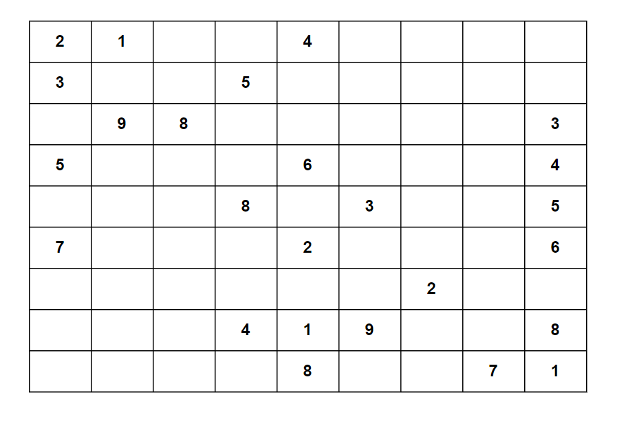

**Problem statement:**
Given a `9 x 9` Sudoku board `board`. A Sudoku board is valid if the below rules are followed:

1. Each row must contain the digits 1-9 without duplicates.
2. Each column must contain the digits 1-9 without duplicates.
3. Each of the nine 3 x 3 sub-boxes of the grid must contain the digits 1-9 without duplicates.

Return `true` if the board is valid, otherwise return `false`.

**Note:** Only filled cells needs to be validated and board doesn't needs to be solvable.

## Examples:
Example 1:

Input: board = 
[["2","1",".",".","4",".",".",".","."],
 ["3",".",".","5",".",".",".",".","."],
 [".","9","8",".",".",".",".",".","3"],
 ["5",".",".",".","6",".",".",".","4"],
 [".",".",".","8",".","3",".",".","5"],
 ["7",".",".",".","2",".",".",".","6"],
 [".",".",".",".",".",".","2",".","."],
 [".",".",".","4","1","9",".",".","8"],
 [".",".",".",".","8",".",".","7","1"]]

Output: true

Example 2: 

Input: board = 
[["2","1",".",".","4",".",".",".","."],
 ["3",".",".","5",".",".",".",".","."],
 [".","9","2",".",".",".",".",".","3"],
 ["5",".",".",".","6",".",".",".","4"],
 [".",".",".","8",".","3",".",".","5"],
 ["7",".",".",".","2",".",".",".","6"],
 [".",".",".",".",".",".","2",".","."],
 [".",".",".","4","1","9",".",".","8"],
 [".",".",".",".","8",".",".","7","1"]]

Output: false

**Algorithmic Steps**
This problem is solved with the combination of hashtable and hashset methods. The main intution behind this problem is to keep track of rules to prevent any repetition of the digits with in rows, columns, and square boxes. The algorithmic approach can be summarized as follows: 

1. Initialize three Hashmap objects(`rowsMap`, `colsMap` and `squaresMap`) to store characters for rows,columns, and 3x3 square boxes.
    
2. Iterate over each row `r` of the board. With in each row, iterate over each column `c` of the board.
   
3. Find the character `cell` at each co-ordinate of the board. 

4. If the cell is equals to `.`, skip the current iteration.
   
5. If the cell is already present in the respective row, column or square boxes, return `false` indicating that the board is not valid.
   
6. Otherwise, add the cell to the respective sets in their row, column and square box.
   
7. Continue with the next cells until all the cells are traversed in the board.
   
8. Return `true` if all the cells are valid, indicating the board is valid.

**Time and Space complexity:**
This algorithm has a time complexity of `O(9^2)~O(81)~O(1)`. This is because the first loop iterate over each cell in the row(1-9), and second loop iterate over each cell in the current column(1-9). Since the board doesn't scale along with input size, the operations are all constant time with time complexity of `O(1)`.

Here, the maximum storage required by hash maps is constant with 81 entries. Hence, the space complexity will be `O(1)`.
