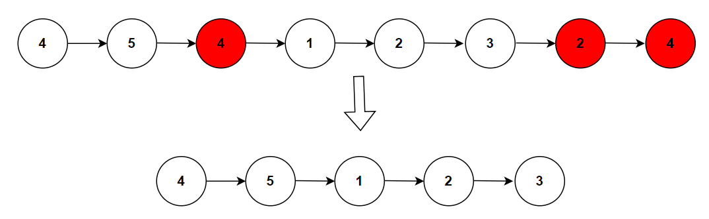

**Problem statement:**
Given an unsorted linked list. You need to remove the duplicates from the linked list, and return the modified list.

**Note:** You need to preserve the original relative order of the nodes.

## Examples:
Example 1:

Input: [4,5,4,1,2,3,2,4]
Output: [4,5,1,2,3]

## Pictorial representation

 

**Algorithmic Steps**
This problem is solved with the help of two pointers along with set data structure. The main intuition of this problem is removing the duplicate node by connecting the previous node to next node of the removed node. If the node is not duplicate, it is added to Set data structure. The algorithmic approach can be summarized as follows: 
   
1. Create a Set named `noDuplicates` to store the unique list elements.

2. Create a current pointer(`current`) to traverse the list. It is initialized with head node.

3. The previous node is stored in `prev`, which is used to hold the previous element during the iteration. It is initialized with `null`.
   
4. Loop over the original list until the current pointer is not null.

5. In each iteration, if the current node is already present in a set then remove that node by connecting the previous node with next node of current node.
   
6. Otherwise, add the current node to a set. Also, the previous node is updated to current node.
   
7. Update the current node to its next element for each iteration.
   
8. Return the modified list which doesn't contain any duplicate nodes.

**Time and Space complexity:**
This algorithm takes a time complexity of `O(n)`, where `n` is the number of nodes in the list. This is because we needs to traverse at most once to remove the duplicates.

Here, we don't use any additional datastructure other than few pointer variables. Hence, the space complexity will be `O(1)`.
