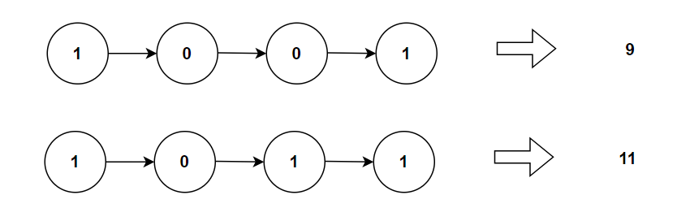

**Problem statement:**
Given a `head` of singly linked list. The linked list holds the binary representation of a decimal number using either 0 or 1 digit. Calculate the decimal value of the linked list and return the number.

**Note:** The MSB(Most Significant Bit) is situated at the head of linkedlist.

## Examples:
Example 1:

Input: [1,0,0,1]
Output: 9

Example 2:

Input: [1,0,1,1]
Output: 11

## Pictorial representation

 

**Algorithmic Steps**
This problem is solved with the help of linked list iteration and mathematic calculations. The algorithmic approach can be summarized as follows: 
   
1. Create a current node(`current`) to traverse the list. It is initialized with head node.

2. Create a decimal variable(`decimal`) to store the decimal equivalent and initialized to zero. 
   
3. Loop over the list until the current pointer is not null. The loop starts from left to right.

4. In each iteration, update the decimal value by adding the previous decimal value and the product of power of 2 with current binary digit.
   
5. Update the current node to its next element for each iteration.
   
6. Return the decimal value as equivalent binary number.

**Time and Space complexity:**
This algorithm takes a time complexity of `O(n)`, where `n` is the number of nodes in the list. This is because we needs to traverse at most once to calculate the decimal equivalent.

Here, we don't use any additional datastructure other than one pointer variable. Hence, the space complexity will be `O(1)`.
