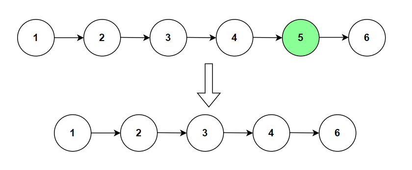

**Problem statement:**
Given the `head` of a linked list, and an integer `k`. remove the `k`th node from the end of the list and return its head.

## Examples:
Example 1:

Input: head = [1,2,3,4,5,6], k=2
Output: [1,2,3,4,6]

Example 2: 

Input: head = [3], k=1
Output: []

## Pictorial representation

 

**Algorithmic Steps**
This problem is solved with the help of two pointers approach and maintaining a dummy node. The algorithmic approach can be summarized as follows: 

1. Accept the `head` node of the linkedlist and an integer `k` to represent node position from end of the list.
   
2. Create a `dummy` node to cover the edge cases such as list with a single node, and also finding a node before the removed node.

3. Connect dummy node to head node of the list.

4. Create two pointers named `first` and `second`, which are pointed to dummy and head nodes. 
   
5. Loop over the list `k` number of times and update the `second` pointer to next node for each iteration.

6. Loop over the list again until `second` pointer is not equal to null.
   
7. Update both `first` and `second` pointerq to their next node for each iteration of previous loop. Once the loop ends, the `first` pointer sits at the node just before the removed node.

8. Skip the removed node by connecting the node of first pointer with the node after the removed node.
    
9.  Return the next node of dummy node which represents the new head node of modified list.

**Time and Space complexity:**
This algorithm takes a time complexity of `O(n)`, where  `n` is the number of nodes in the list `head` and `k` represents the node from the last. This is because we need to traverse each node in the list.

Here, we don't use any additional datastructure other than few pointer variables. Hence, the space complexity will be `O(1)`.
