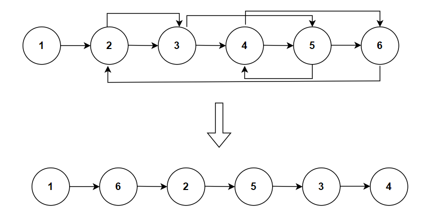

**Problem statement:**
Given the `head` of a linked list with nodes labeled from `L0` to `Ln`. Reordered the list in a particular pattern where the first node is followed by the last node, the second node is followed by the second to last node, and this pattern continues until all nodes have been reordered.

**Note:** You may not modify the values in the list's nodes, but instead you must reorder the nodes themselves.

## Examples:
Example 1:

Input: head = [1,2,3,4,5,6]
Output: [1,5,4,3,2,6]

Example 2: 

Input: head = []
Output: []

## Pictorial representation

 

**Algorithmic Steps**
This problem is solved with the help of two pointers approach and reverse the node links logic. The algorithmic approach can be summarized as follows: 

1. Accept the `head` node of the linkedlist.

2. Cover the edge case scenario by retuning immediately if the head is null
   
3. Create a `slow` and `fast` pointers to traverse the list. They are initialized to `head` node. The fast pointer moves twice as the slow pointer.

4. Find the middle of the list by traversing using two pointers. The traversal needs to continue until the next and it's next nodes are not equal to null. At the end of the loop, the slow pointer is at the middle of list.

5. Split the list into two parts and reverse the second half of the list. The next node of `slow` pointer is stored in a `secondHalf` node to indicate the beginning of second half.
   
6. The list splits into two parts by breaking the link from slow pointer. Also, create another node `prev` to link with previous node.

7. Loop over the list again to reverse the node links in second half. The `prev` node holds the last element in the second half.
   
8. Reorder the full list by referring `firstHalf` to head node and `secondHalf` to prev node. At the end of this loop, the original list is reordered by alternating nodes between start and end nodes of the list.

**Time and Space complexity:**
This algorithm takes a time complexity of `O(n)`, where  `n` is the number of nodes in the list `head` . This is because we need to traverse each node in the list at most twice(`O(2n) ~= O(n)`).

Here, we don't use any additional datastructure other than few pointer variables. Hence, the space complexity will be `O(1)`.
