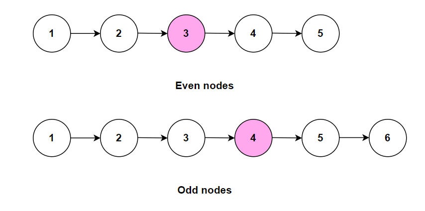

**Problem statement:**
Given the `head` of a linked list. Find the middle node of the linkedlist.

**Note:** If the list has an even number of nodes, you should return the second of the two middle nodes.

## Examples:
Example 1:

Input: head = [1,2,3,4,5]
Output: [3,4,5]

Example 2: 

Input: head = [1,2,3,4,5,6]
Output: [4,5,6]

## Pictorial representation

 

**Algorithmic Steps**
This problem is solved with the help of two pointers approach. The algorithmic approach can be summarized as follows: 

1. Accept the `head` node of the linkedlist.
   
2. Create two pointers named `slow` and `fast` to traverse the list. Here, the fast pointer moves twice as the slow pointer. Both are initialized to `head` node.

3. Loop over the list until fast pointer and it's next node are not equal to null.

4. In each iteration, update the slow pointer to it's next node and fast pointer to it's next's next node.
   
5. At the end of the loop, the slow pointer is situated at middle node of the list.

6. Return `slow` pointer as the middle node.

**Time and Space complexity:**
This algorithm takes a time complexity of `O(n)`, where  `n` is the number of nodes in the list `head` . This is because fast pointer needs to traverse at most once to reach the end.

Here, we don't use any additional datastructure other than few pointer variables. Hence, the space complexity will be `O(1)`.
