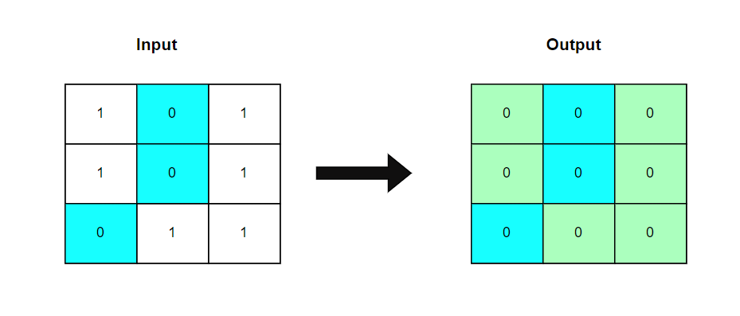
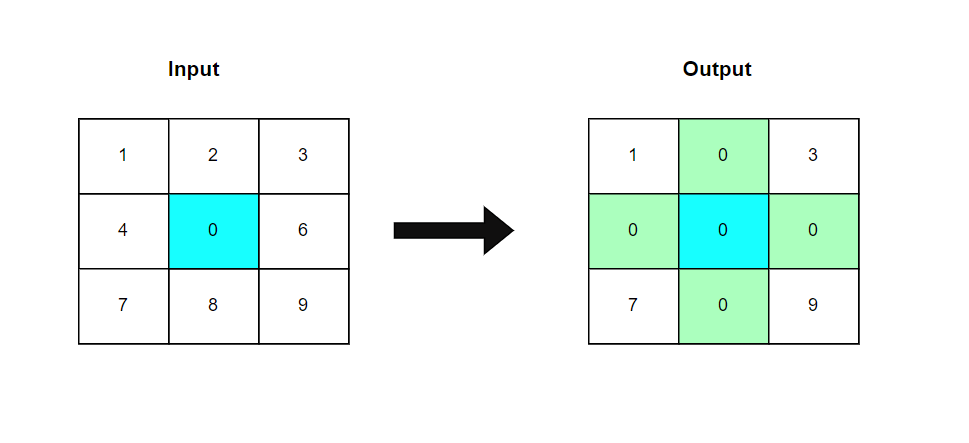

**Problem statement:**
Given an `m x n` matrix of integers `matrix`, if an element is `0`, set its entire row and column to `0`'s.

**Note:** You must update the matrix in-place using constant space solution(`O(1)`).

## Examples:
Example1:

Input: matrix = [
[1, 0, 1], [1, 0, 1], [0, 1, 1]
]

Output: [
  [0,0,0],
  [0,0,0],
  [0,0,0]
]

Example2:

Input: matrix = [
[1, 2, 3], [4, 0, 6], [7, 8, 9]
]

Output: [
[1, 0, 3], [0, 0, 0], [7, 0, 9]
]

**Algorithmic Steps**
This problem is solved by in-place alogorithm in which first row and first column of given matrix acts as markers for setting zeroes in cells. Since the first cell is used to track the first column zeros, we need to take an extra boolean marker for first row zeroes. The algorithmic approach can be summarized as follows: 

1. Create a function(`setZeroes`) by accepting the `m*n` matrix as input parameter.
   
2. Store the number of rows(`rows`) and columns(`cols`) of a matrix for iteration purpose. The first row and first column acts as markers to indicate which rows and columns should set to zero. The boolean marker `rowZero` is used as a zero marker for first row because the first cell is used as marker for first column cells.

3. Iterate over each cell of a matrix to mark which columns and rows to be set to zero,
    1. If the cell value is zero, set the respective column's first row value to zero. 
    2. If the cell's row is greater than zero, set the respective row's first column value to zero.
    3. Otherwise, set `rowZero` to `true` indicating that first row marked for zeros.
   
4. Iterate each cell again except first row and first column, set the cell value to zero based on first row and first column values.

5. Set zeros to first column if first cell's value is zero.
6. Set zeros to first row if the boolean marker `rowZero` is `true`. 
7. At this stage, given matrix is updated with zeros for respective rows and columns without using additional space.

**Time and Space complexity:**
This algorithm has a time complexity of `O(m*n))`, where `m` is the number of rows and `n` is the number of columns in the given matrix. This is because each cell visited twice, once to mark the rows and columns that should be set to zero and once to actually set the zeroes in cells.

It requires `O(1)` constant space complexity irrespective of the matrix size. This is becuase it uses only one variable(`rowZero`),which is used to mark the first row cells to be zero or not.
