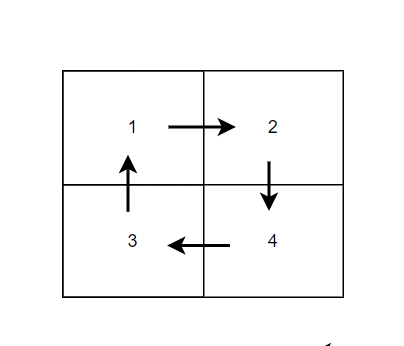
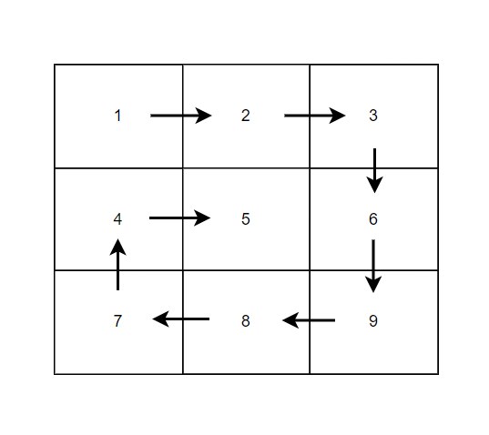
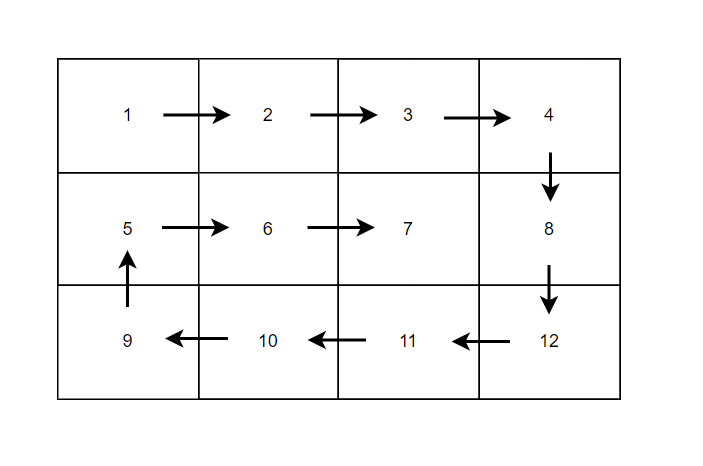
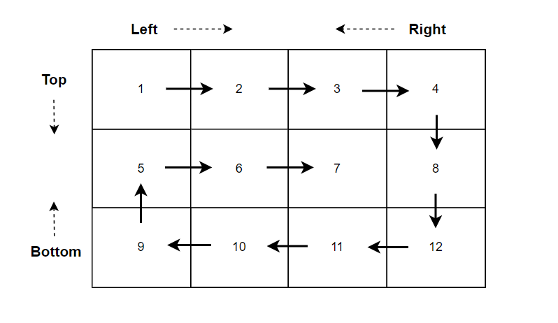

**Problem statement:**
Given an `m x n` matrix of integers `matrix`, return a list of all elements within the matrix in spiral order.

## Examples:
Example1:

Input: matrix = [[1,2],[3,4]]

Output: [1,2,4,3]

Example2:

Input: matrix = [[1,2,3],[4,5,6],[7,8,9]]

Output: [1,2,3,6,9,8,7,4,5]

Example3:

Input: matrix = [[1,2,3,4],[5,6,7,8],[9,10,11,12]]

Output: [1,2,3,4,8,12,11,10,9,5,6,7]

**Algorithmic Steps**
This problem is solved by boundary traversal(i.e, all four sides of a matrix) until all the cells covered. The algorithmic approach can be summarized as follows: 

1. Create a function(`spiralOrder`) by accepting the `m*n` matrix as input parameter.
   
2. Define four pointers left, right, bottom and top referring the four corners of a matrix. The left pointer is initialized to first column index(`0`), right pointer to last column index(`matrix[0].length`), bottom pointer to last row index(`matrix.length`) and top pointer reffering to first row index(`0`). Create a spiral order out array(`traversal`) to store the elements of a matrix.

3. Traverse over each cell until either left pointer less than or equals to right pointer, or top pointer is less than or equals to bottom pointer. The matrix is covered in all four directions using nested loops.

   1. Iterate over each cell in the first row, starting left to right index and add respective value to output array. Thereafter, increment the top pointer to refer next row indicating that current row is processed.
   
   2. Iterate over each cell in the last column, starting top to bottom index and add respective value to output array. Thereafter, decrement the right pointer to refer previous column indicating that current column is processed.
   
   3. Iterate over each cell in the last row, starting from right to left index and add respective value to output array. Thereafter, decrement the bottom pointer to refer previous row indicating that current row is processed.

   4. Iterate over each cell in the first column, starting from bottom to top index and add respective value to output array. Thereafter, increment the left pointer to refer previous row indicating that current row is processed.

4. Return `traversal` array, which contains the spiral order of given matrix.

**Time and Space complexity:**
This algorithm has a time complexity of `O(m*n))`, where `m` is the number of rows and `n` is the number of columns in the given matrix. This is because each cell of the matrix visited exactly once.

It requires `O(1)` constant space complexity irrespective of the matrix size. This is becuase we don't need to use any additional temporary space.
**Note:** The output array is ignored for complexity.
