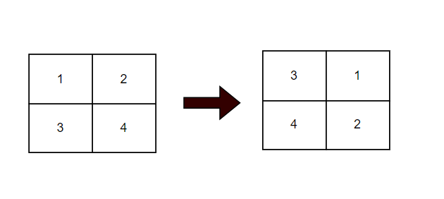
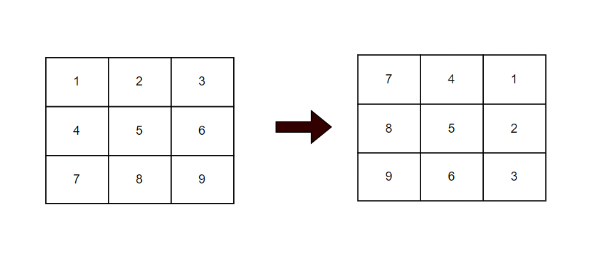
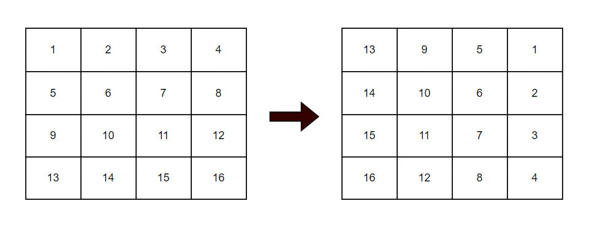
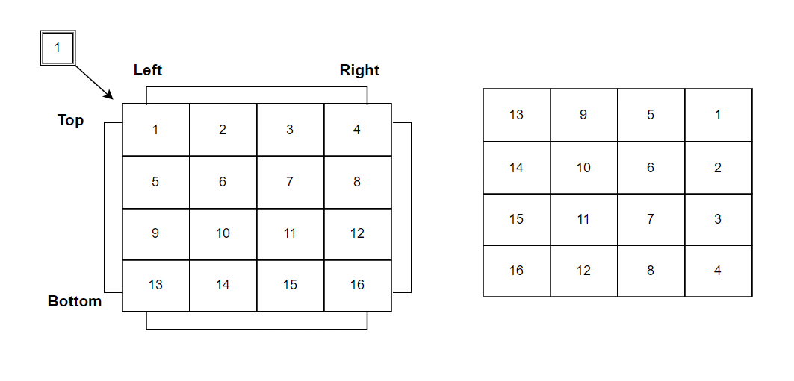

**Problem statement:**
Given an `n x n` square matrix of integers `matrix`, rotate it by 90 degrees clockwise.

**Note:** You must rotate the matrix in-place without allocating another 2D matrix to do the rotation.

## Examples:
Example1:

Input: matrix = [
    [1,2],
    [3,4]
  ]

Output: [
    [3, 1],
    [4, 2]
]

Example2:

Input: matrix = [
    [1,2,3],
    [4,5,6],
    [7,8,9]
 ]

Output: [  
  [7,4,1],
  [8,5,2],
  [9,6,3]
]

Example3:

Input: matrix = [
    [1,2,3],
    [4,5,6],
    [7,8,9]
]

Output: [  
    [1, 2, 3, 4], 
    [5, 6, 7, 8],
    [9, 10, 11, 12], 
    [13, 14, 15, 16]
]

**Algorithmic Steps**
This problem is solved by inplace square rotation technique in which corner cells of a square rotated by 90 degress in a clockwise direction. Moreover, the rotation starts from bottom left cell and one extra variable is used to store the previous value of top left cell value. The algorithmic approach can be summarized as follows: 

1. Create a function(`rotateImage`) by accepting the `n*n` matrix as input parameter.
   
2. Define two pointers `left` and `right` point to first and last column indexes. They are helpful to traverse over the cells.

3. Traverse over each cell until left pointer is less than equals to right pointer.

   1. Add a nested loop `n-1`(i.e, `right-left`) times to update the cell values by 90 degrees.
        1. Store the top left cell's value in a temporary variable(`topLeft`) before it is going to updated.
        2. Move bottom left value to top left cell's position.
        3. Move bottom right value to bottom left cell's position.
        4. Move top right value to bottom right cell's position.
        5. Copy top left temporary variable to top right cell's position.
   
   2. Increment left pointer by 1 and decrement right pointer by 1 upon completion of one full rotation.
   
4. Repeat the rotation until all the cells rotated by 90 degrees. i.e, left pointer is less than right pointer.

**Time and Space complexity:**
This algorithm has a time complexity of `O(n^2))`, where `n` is the number of rows or the number of columns in the given matrix. This is because each element needs to moved exactly once.

It requires `O(1)` constant space complexity irrespective of the matrix size. This is becuase we don't need to use any additional temporary space(except a pointer variable) considering inplace matrix update.
