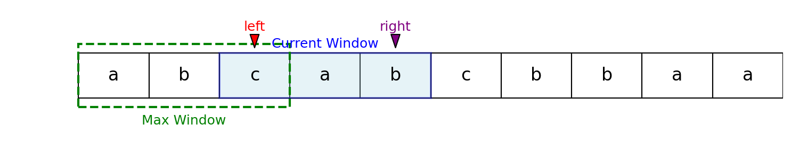

**Description:**
Given a string `str`, find the length of the longest substring without repeating characters.

## Examples

**Example 1:**  
Input: `s = "abcabcbbaa"`  
Output: `3`  
Explanation: The longest substring is `"abc"`.

**Example 2:**  
Input: `s = "aaaaaaa"`  
Output: `1`  
Explanation: The longest substring is `"a"`.

**Example 3:**  
Input: `s = "pwwkew"`  
Output: `3`  
Explanation: The longest substring is `"wke"`.

## Visualization

## Algorithm

This problem is efficiently solved using the **sliding window** technique with a Set to track unique characters in the current window.

1. Initialize an empty Set to store unique characters.
2. Use two pointers, `left` and `right`, to represent the current window.
3. Move the `right` pointer through the string:
    - If the character at `right` is not in the Set, add it and update the maximum length.
    - If the character is already in the Set, remove characters from the left of the window (increment `left` and remove from Set) until the duplicate is removed.
4. Continue until the end of the string.
5. The maximum window size found is the answer.

**Time and Space complexity:**

- **Time Complexity:** O(n), where n is the length of the string (each character is visited at most twice).
- **Space Complexity:** O(min(n, m)), where m is the size of the character set (e.g., 26 for lowercase English letters).
