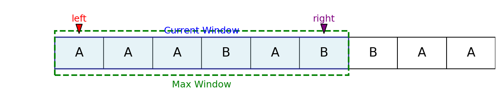

# Longest Repeating Character Replacement

Given a string `str` and an integer `k`, you can replace at most `k` characters in the string with any uppercase English letter. Return the length of the longest substring containing the same letter you can get after performing the above operations.

## Examples

**Example 1:**  
Input: `str = "AAABABBAA"`, `k = 2`  
Output: `6`  
Explanation: Replace the two 'B's in the middle with 'A' to get "AAAAAAA".

**Example 2:**  
Input: `str = "BBBB"`, `k = 2`  
Output: `4`  
Explanation: No replacements needed.

## Visualization

The sliding window moves over the string, expanding to the right and shrinking from the left as needed. The window always contains at most `k` characters that need to be replaced to make all characters in the window the same.
You can visualize this with a diagram showing the window over the string, highlighting the current window and the maximum window found.

## Algorithm

This problem is efficiently solved using the **sliding window** technique:

1. Use a fixed-size array to count the frequency of each character in the current window.
2. Use two pointers (`left` and `right`) to represent the window.
3. For each character at `right`, update its count and track the maximum frequency in the window.
4. If the window size minus the max frequency exceeds `k`, shrink the window from the left.
5. Update the maximum window size found.

## Complexity

- **Time Complexity:** O(n), where n is the length of the string.
- **Space Complexity:** O(1), since the character count array is always of size 26.

