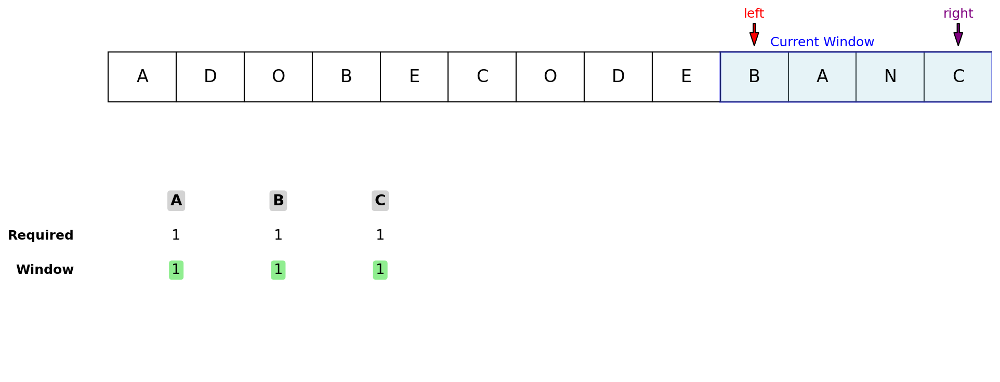

**Description:**
Given two strings `str` and `subStr` of lengths `m` and `n` respectively, return the minimum window 
substring of `str` such that every character in `subStr` (including duplicates) is included in the window. If there is no such substring available, just return the empty string(i.e,"").

### Examples

**Example 1:**  
Input: `str = "ADOBECODEBANC"`, `subStr = "ABC"`  
Output: `"BANC"`  
Explanation: The minimum window substring `"BANC"` includes 'A', 'B', and 'C' from `subStr`.

**Example 2:**  
Input: `str = "A"`, `subStr = "A"`  
Output: `"A"`

**Example 3:**  
Input: `str = "a"`, `subStr = "aa"`  
Output: `""`

## Visualization

The sliding window expands to include all required characters, then contracts to find the smallest valid window. You can visualize this with a diagram showing the window's movement over the string, highlighting the current and minimum windows found.

## Algorithm

This problem is efficiently solved using the **sliding window** technique with two hash maps:

1. Count the frequency of each character in `subStr` using a hash map.
2. Use two pointers (`left` and `right`) to represent the current window in `str`.
3. Expand the window by moving `right` and update the window's character counts.
4. When the window contains all characters of `subStr` with the required frequency, try to shrink the window from the left to find the minimum.
5. Track the minimum window found during the process.
6. Return the minimum window substring, or `""` if no such window exists.

## Complexity

- **Time Complexity:** O(m + n), where m and n are the lengths of `str` and `subStr`.
- **Space Complexity:** O(m + n), for the hash maps.
