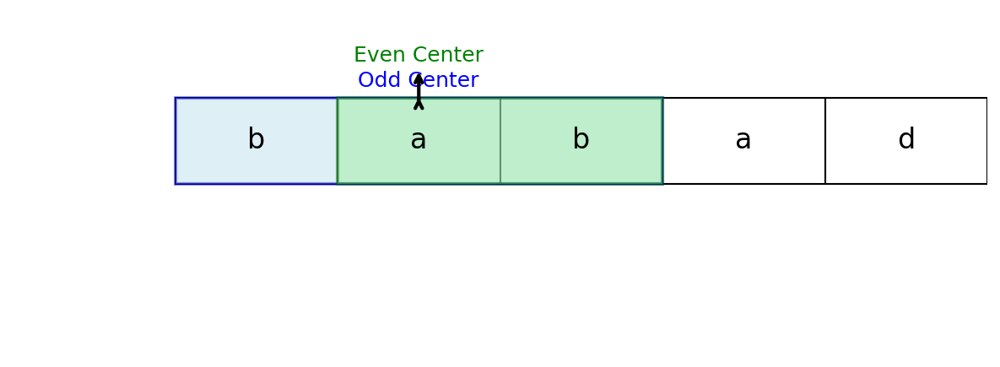

**Description:**
Given a string `str`, return the longest palindromic substring of `str`.

**Note:** A palindrome is a string that reads the same backward as forward. If there are multiple palindromic substrings of the same length, return any one of them.

## Examples

**Example 1:**  
Input: `str = "ababd"`  
Output: `"aba"`

**Example 2:**  
Input: `str = "dbbc"`  
Output: `"bb"`

**Example 3:**  
Input: `str = "babad"`  
Output: `"bab"` (or `"aba"`)

## Visualization

## Algorithm

This problem is efficiently solved using the **expand around center** approach where we expand the input string at each position:

1. If the string is empty or has length 1, return the string.
2. For each character in the string, treat it as the center of a palindrome and expand outwards to check for the longest odd and even length palindromes.
3. Use a helper function to expand around the center and return the bounds of the palindrome.
4. Track the start and end indices of the longest palindrome found.
5. Return the substring between the start and end indices.

## Complexity

- **Time Complexity:** O(n²), where n is the length of the string (for each center, expand up to n).
- **Space Complexity:** O(1), as no extra data structures are used.