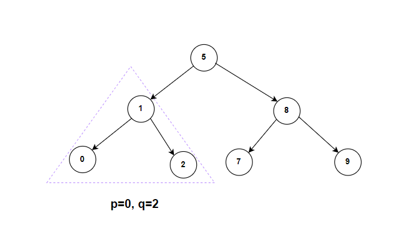

**Problem statement:**
Given the `root` of a binary search tree (BST) where all node values are unique, and two nodes from the tree `p` and `q`, return the lowest common ancestor (LCA) of the two nodes.

The lowest common ancestor between two nodes `p` and `q` is the lowest node in a BST such that both `p` and `q` as descendants. 

**Note:** Each node is allowed to be a descendant of itself.

## Examples:
Example1:

Input: root = [5,1,8,0,2,7,9], p=0, q=2
Output: 1

Example2:

Input: root = [5,1,8,0,2,7,9], p=8, q=9
Output: 2

**Algorithmic Steps**
This problem is solved by iterative tree traversal. The algorithmic approach can be summarized as follows: 

1. Create a function(`lowestCommonAncestor`) to find the lowest common ancestor of two nodes in a binary search tree. It accepts root node along with two nodes as input parameters. 

2. Create a current node(`currNode`) pointing to root node. This is because the tree iteration starts from the root node.
   
3. Iterate over the BST nodes until the current node is not null.
   
   1. If the current node's value is greater than both node values, move to left subtree to find the ancestor.
   2. If the current node's value is less than both node values, move to right subtree to find the ancestor.
   3. Otherwise, return the current node as lowest common ancestor. It indicates that there is a split at the current node where the two nodes exists in different branches.

4. Return `null` if you pass any of the nodes which doesn't exist in the BST.

**Time and Space complexity:**
This algorithm has a time complexity of `O(h)`, where `h` is the height of the binary tree. This is because each time we visit exactly one node from each level. In case of unbalanced tree, all nodes exists in one side and `h` equals to number of nodes `n` in the tree, so the time complexity is going to be `O(n)` .  

It requires a space complexity of `O(1)` because only one pointer variable is used to track the current node.
