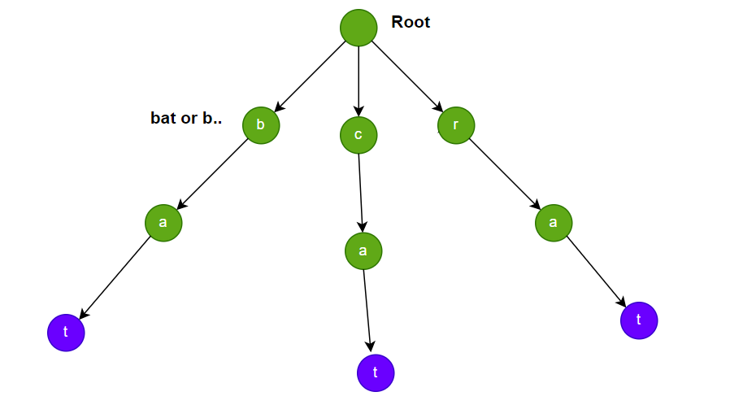

**Problem statement:**
Design a data structure that supports adding new words and searching for existing words.

Implement the WordDictionary class with below funcitonalities:

1. `WordDictionary()` Initializes the object.
2. `void addWord(word)` Adds word to the data structure.
3. `bool search(word)` Returns `true` if there is any string in the data structure that matches word or `false` otherwise. Here, the word may contain dots '.' where dots can be matched with any letter.

## Examples:
Example1:

Input: ["Trie", "insert", "bat", "insert", "cat", "insert", "rat", "search", "mat", "search", "bat", "search", ".at","search", "c.."]

Output:
[null, null, null, null, false, true, true,true]

**Algorithmic Steps**
This problem is solved with the help of trie datastructure and DFS with backtracking for searching words which have dots in the given string. The algorithmic approach can be summarized as follows: 

1. Create a node class with properties such as children map(`children`) and boolean to indicate end of word(`isEndOfWord`).By default, the boolean property assigned with `false` value.

2. Create a word dictionary class(`WordDictionary`) similar to trie datastructure, consists of `root` node as its property. This class has 2 major functionalities, insert and search.
   
3. The insert function(`addNode`) accepts the given string(`word`) as an input parameter.
   1. At first, assign a current node pointing to root node because the traversal starts from root node.
   2. Iterate over each character in the word and verify if that character exists or not. If not exists, create a new node with the character as a key.
   3. If the character exists, move the pointer to next character node of trie.
   4. At the end, update the end of word(`isEndOfWord`) boolean flag to true.

4. The search function(`search`) accepts the given string(`word`) as input parameter and calls dfs function recursively for each character of the given word.
   
5. The dfs function(`dfs`) accepts the word, current index and current node in trie structure.
   
   1. Add base checks, such as returning `false` for null node and returning `isEndOfWord` flag if the index is equals to word length.
   
   2. If the current character is equals to dot(.), iterate over each character node of its children and return `true` based on recursive dfs function call. Otherwise, return `false`.
   
   3. If there is a specific alphabet character, return `false` if the character doesn't exists in the children nodes. Whereas if the character exists, invoke the dfs function recursively for verifying the next characters.

6. If the given word exists in the dictionary, the search function returns `true`, otherwise returns `false`
     

**Time and Space complexity:**
The insert function in this algorithm takes a time complexity of `O(n)`, where `n` is the number of characters in the given word. This is because we need to iterate through each character of the word and perform constant time operations lookup or insertion. 

Whereas, search function requires a time complexity of `O(m*n)`, where `m` is the maximum number of children (26 English alphabet) and `n` is the number of characters in the given word. This is due to dfs function performed on each node in case of more dots in the given word.

The overall space complexity of the Trie data structure is `O(m * n)`, where `m` is the maximum number of children (26 English alphabet) and `n` is the average length of the word. This is required to store all those characters in a trie structure.
