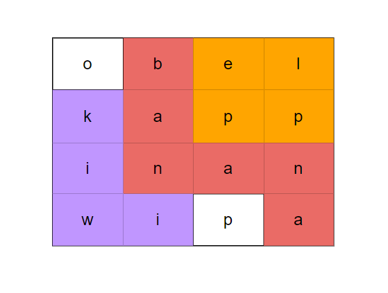

**Problem statement:**
Given a 2-demensional grid of characters `board` and a list of strings `words`, return all words that are present in the grid.

Here, each word is formed in a path in the board with horizontally or vertically neighboring cells. The same cell may not be used more than once in a word.

## Examples:
Example1:

Input: board = [["o","b","e","l"],["k","a","p","p"],["i","n","a","n"],["w","i","p","a"]], words = ["apple","banana","pineapple","kiwi", "orange"]
Output: ['banana', 'kiwi', 'apple']

Example2:

Input: board = [["p","q"],["p","q"]], words = ["pqpq"]
Output: []

**Algorithmic Steps**
This problem is solved with the help of trie datastructure and DFS backtracking for searching words which have dots in the given string. The algorithmic approach can be summarized as follows: 

1. Create a node class(`Node`) with properties such as children map(`children`) and `fullword` string type to indicate the new word formed. By default, this string property is empty.

2. Create a word search class(`WordSearch2`) to build the words in trie datastructure. It consists of `root` node as its member property. This class has 2 major functionalities, build trie and search words.
   
3. The build trie function(`buildTrie`) accepts the given list of string(`words`) as an input parameter. It iterates overs the list of words and form various branches of trie structure using below step by step instructions.
   
   1. Assign a current node pointing to root node because the traversal starts from root node.
   2. Iterate over each character in the word and verify if that character exists or not. If not exists, create a new node with the character as a key.
   3. If the character exists, move the pointer to next character node of trie.
   4. At the end, update the completion of full word(`fullWord`) in the current node.

4. The search function(`findWords`) accepts `m*n` board of characters and the list of search words(`words`) as input parameters. As a first step, it invokes the build trie function to form a trie strucuture. This is helpful for efficient search through dictionary. Thereafter, we need to go through all possible cells in the board and recurivesly call DFS function to collect all the possible words. 
   
5. We need to create DFS backtracking function(`dfs`) which is used to explore the board and find the possible paths. It accepts the board of characters, list of found words result, trie root, row and column indexes. This function has sequeuenc of steps on each board cell,
   
   1. Add checks for out of boundary conditions(i.e, < 0 or >=length) and exit from the function.
   2. If the character is alreay visited( represented as `#`) and character doesn't exist in trie, return immediately from the function.
   3. Otherwise, navigate to the next child node and verify whether the word is completed or not. Once the new word is found, add it to the result found list.
   
   4. Mark the recently visited node with a placeholder(`#`). This is helpful to avoid revisiting the same character in the board.
   5. Navigate to all the four directions(up,down,left and right) to find the possible path.
   6. Upon finding all possible words with a given starting cell, reset the placeholder with actual board letter.
   
6. Finally, return the list of found words(`list`) as a result from `findWords` function.
     
**Time and Space complexity:**
The build trie function in this algorithm takes a time complexity of `O(m* n)`, where `m` is the number of words and `n` is the average length of each word. This is because we need to iterate through each character of the word and perform constant time operations such as lookup or insertion. 

Whereas, search function requires a time complexity of `O(m*n 4^m*n)`, where `m` is the number of rows and `n` is the number of columns in a board. This is because each cell in the board requires DFS backtracking in all 4 directions with a time complexity of `O( 4^m*n)` and it needs to be repeated all `m*n` cells in the board. Hence, the overall time complexity is `O(m*n 4^m*n)`  

The overall space complexity of the Trie data structure is `O(m * n)`, `m` is the number of words and `n` is the average length of each word. This is required to store all those characters in a trie structure.
