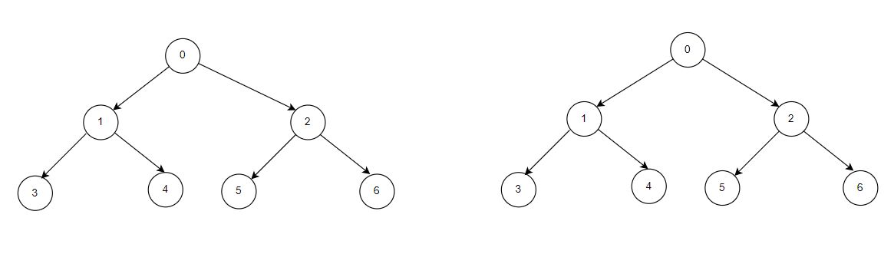

**Problem statement:**
Given the roots of two binary trees `a` and `b`, return `true` if the trees are equivalent, otherwise return `false`.

Any two binary trees are considered equivalent if they share the same structure and the nodes have the same values too.

## Examples:
Example1:

Input: a = [0,1,2,3,4,5,6] b = [0,1,2,3,4,5,6]
Output: true

Example1:

Input: a = [1,2,3] b = [1,3,2]
Output: false

**Algorithmic Steps**
This problem is solved by Depth First Search(DFS) with recursion over left and right substrees. The algorithmic approach can be summarized as follows: 

1. Implement a first base check by returning `true`(same tree) if both trees are null.

2. Add a next base check by returning `false`(not same tree) if any one of the trees is empty(or null) or the values of current nodes doesn't match.

3. Recursively check if left subtrees of both trees and right subtress of both trees are same or not.

**Time and Space complexity:**
This algorithm has a time complexity of `O(n)`, where `n` is the number of nodes in the smaller tree. This is because the function is called recursively on each node of the trees. 

It requires a space complexity of `O(n)` because recursive calls generates a call stack size equal to the number of nodes in the tree.
