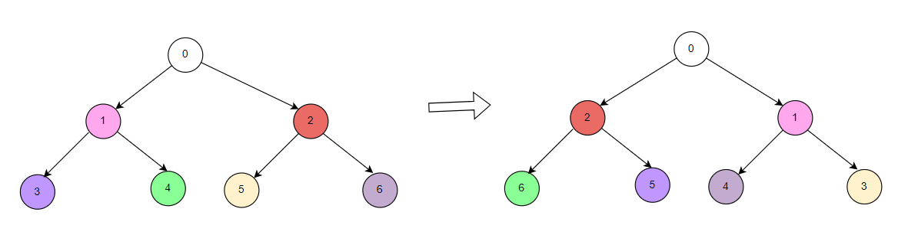
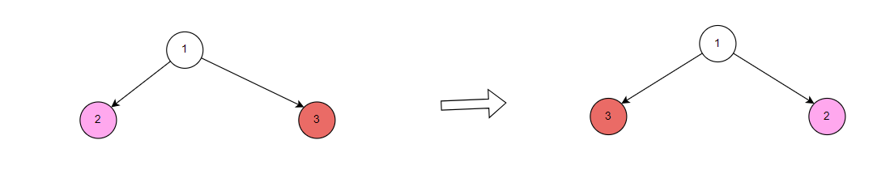

**Problem statement:**
Given the `root` of a binary tree root. Invert the binary tree and return its root.

## Examples:
Example1:

Input: a = [0,1,2,3,4,5,6] b = [0,1,2,3,4,5,6]
Output: true

Example1:

Input: a = [1,2,3] b = [1,3,2]
Output: false

**Algorithmic Steps**
This problem is solved by swapping nodes and Depth First Search(DFS) with recursion over left and right substrees. The algorithmic approach can be summarized as follows: 

1. Add base check by returning `null` immediately if the tree node is null.

2. Swap left and right nodes using a temporary variable.

3. Invert left subtree of current node followed by right subtree of current node.

4. After all the recursions, the binary tree is converted to a inverted tree. 

**Time and Space complexity:**
This algorithm has a time complexity of `O(n)`, where `n` is the number of nodes in the given tree. This is because DFS function is called exactly once for each node of the tree. 

It requires a space complexity of `O(n)` because recursive calls generates a call stack size equal to the number of nodes in the skewed tree(i.e, each node with only one child).
