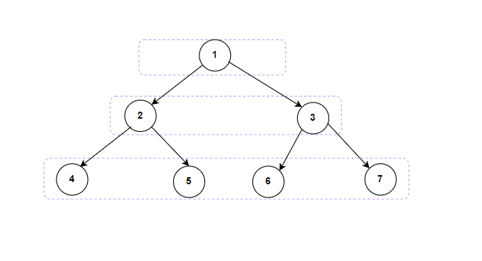

**Problem statement:**
Given the `root` of a binary tree, return the level order traversal of its nodes' values as a nested list. Here, each sublist contains the nodes' values at a specific level in the binary tree, from left to right.

## Examples:
Example1:

Input: root = [1, 2, 3, 4, 5, 6, 7]
Output: [[1],[2,3],[4,5,6,7]]

Example2:

Input: root = [3]
Output: [[3]]

Example3:

Input: root = []
Output: []

**Algorithmic Steps**
This problem is solved by Breadth-First-Search(BFS) where it uses queue datastructure. The algorithmic approach can be summarized as follows: 

1. Accept the `root` node of a binary tree as an argument. 
   
2. Create a `traversal` variable which is used to store nested lists with respect to each level.

3. Create a queue datastructure (`queue`) to store the nodes at each level.

4. Start the level order traversal by adding a root node to queue.
   
5. Loop over the queue until there are no nodes exists.

6. Create `len` and `currLevel` variables to store the length of queue and the current level nodes.

7. Process all the nodes of a queue using a nested while loop until the length is greater than zero. 
   
8. Inside the nested while loop, pop out the top node of a queue and add it to the current level. If the left and right subtrees avaialble, add them to the queue for the next level processing. At the last step, decrease the length variable indicating the current node popped-out from queue.
   
9. In the outer loop, add each current level to the output list.
    
10. Return `traversal` which holds the list of level order nodes' lists.

**Time and Space complexity:**
This algorithm has a time complexity of `O(n)`, where `n` is the number of nodes in the given tree. This is because each node in the tree is visited exactly once during the traversal. 

It requires a space complexity of `O(n)` because queue is used for traversal and it can take upto `n` nodes.
