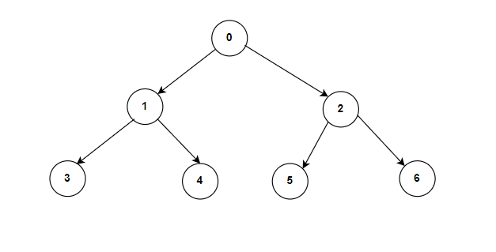

**Problem statement:**
Implement an algorithm to serialize and deserialize a binary tree.

Serialization is the process of converting an in-memory data structure or an object into a sequence of bits so that it can be stored or transmitted across a network to be reconstructed later in an another computer environment. You just need to ensure that a binary tree can be serialized to a string and this string can be deserialized to the original tree structure.

**Note:** There is no additional restriction on how your serialization/deserialization algorithm should work.

## Examples:
Example1:

Input: root = [0, 1, 2, 3, 4, 5, 6]
Output: [0, 1, 2, 3, 4, 5, 6]

Example2:

Input: root = []
Output: []

**Algorithmic Steps**
This problem is solved by Depth-First-Search(DFS) preorder traversal. The algorithmic approach can be summarized as follows: 

1. Create a serialize function(`serialize`) which accept the `root` node of a binary tree as an argument. 
   
2. Initialize an empty array `list` to store the node values.
   
3. Create a helper function `serializeDFS`, which uses DFS preorder traversal(i.e, node-left-right order) to encode the nodes into a common separated strings.
   1. Add a base check if the node is equal to null then insert `N` as value inside the list. Thereafter, return immediately considering it as leaf node.
   2. If not null, add the node's value to the list.
   3. Recursively call the dfs function on left and right child nodes.

4. After traversing each node, convert the list into comma separated encoded string and return it as serialized string.

5. Create a deserialize function(`deserialize`) which accept the serialized string.
   
6. Convert the serialized string into an array of strings.

7. Create a helper function `deserializeDFS`, which uses DFS preorder traversal(i.e, node-left-right order) to decode the string into binary tree. This funciton accepts array of string tokens as an input.
   1. Get each token based on a global index `i` initialized with 0.
   2. If the token is equals to `N`, increment the index and return null as a node.
   3. If it is not equal, create a tree node with the token value and increment the index.
   4. Update the node's left tree with dfs deserialize function using the remaining tokens.
   5. Update the node's right tree with dfs deserialize function using the remaining tokens.

8. Return the node to parent deserialize function which forms the decoded original binary tree. 
   

**Time and Space complexity:**
Both serialize and deserialize functions takes a time complexity of `O(n)`, where `n` is the number of nodes in the given tree. This is because each node in the tree is visited exactly once during the DFS preorder traversal. 

Each of these two functions requires a space complexity of `O(n)` because each DFS call stack can take upto `n` nodes.
