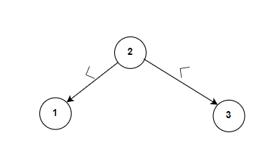
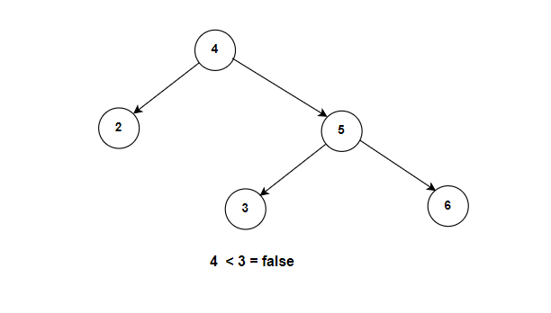

**Problem statement:**
Given the `root` of a binary tree, return `true` if it is a valid Binary Search Tree(BST), otherwise return `false`.

A valid BST follows the below constraints:

1. The left subtree of every node contains only nodes with keys less than the node's key.
2. The right subtree of every node contains only nodes with keys greater than the node's key.
3. Both the left and right subtrees must also be binary search trees.

## Examples:
Example1:

Input: root = [2,1,3]
Output: true

Example2:

Input: root = [4,2,5,3,6]
Output: false

**Algorithmic Steps**
This problem is solved by Depth-First-Search(DFS) using recursion. The algorithmic approach can be summarized as follows: 

1. Create a function(`isValidBST`) to validate the binary search tree, which accepts root node as input. 

2. Create and invoke a DFS function(`dfs`) to verify the boundaries of each node value. This function is called with root node, followed by negative infinity and positive infinity as boundaries.
   
3. The DFS function can be created with arguments as specified in previous step.
   
   1. At first, add a base case check, returning `false` if the tree node is null.
   2. If the node value is not between left and right boundaries, return `false` indicating that invalid BST.
   3. Recursively invoke DFS function on left and right subtrees. This is because each subtree of BST should be a valid BST as well.

4. Returning the DFS function call in step2 determines whether given tree is a BST or not.

**Time and Space complexity:**
This algorithm has a time complexity of `O(n)`, where `n` is the number of nodes in either of the binary trees. This is because DFS visits each node exactly once to compare its boundaries. 

It requires a space complexity of `O(n)` because call stack requires at most length of `n`.
