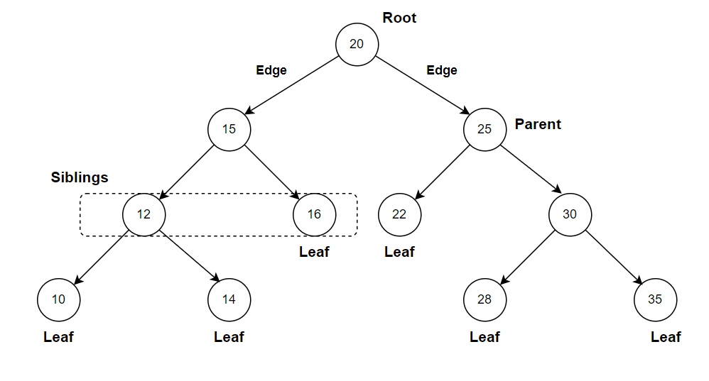
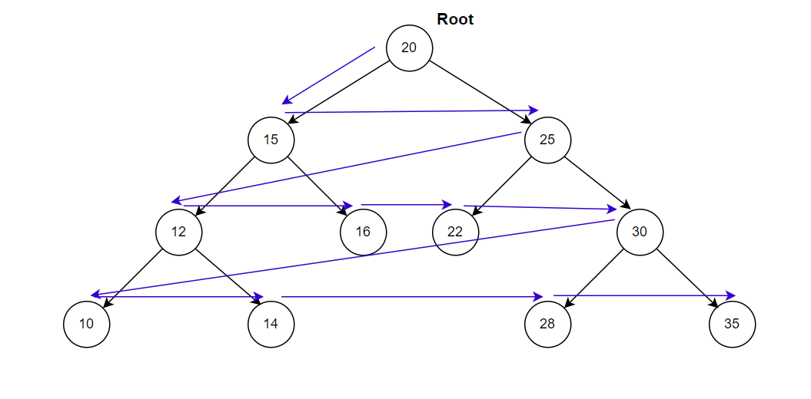
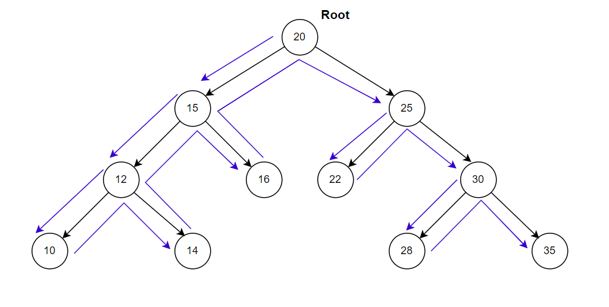
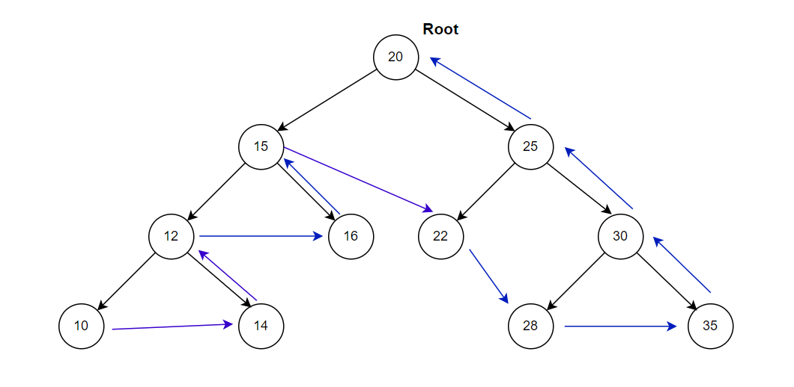
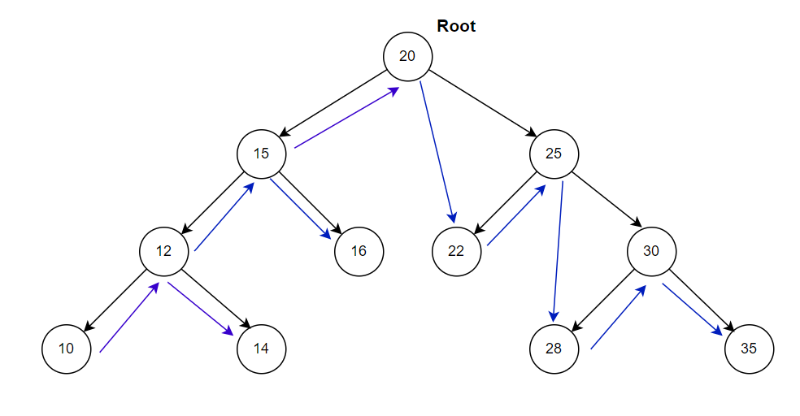

A Binary Search Tree (BST) is a binary tree where every node in the left subtree is less than the root, and every node in the right subtree is of a value greater than the root. This datastructure is mainly used for operations like search, delete, and insert. These operations are fast and efficient without shifting values in memory.

**Note:** Each left and right subtrees must also be Binary Search Tree.

### Types of BSTs:

1. **Full Binary Search Tree:**  Each node will have either 0 or 2 children
2. **Complete Binary Search Tree:** All the levels of the tree are filled completely except possibly the lowest level nodes which are filled from the left.
3. **Perfect Binary Search Tree:** It is both full and complete BST. In which, all the leaf nodes are at the same depth, and all non-leaf nodes have two children.

The structure of binary search tree looks like below,

   

The tree can have the following functionalities,

1. **Insert:** This method is used to insert a new node inside BST based on node's value. If the root node is null, update the root node with newnode and return the tree. Otherwise, you need to traverse the tree using a loop and insert the new node based on its value. i.e, First, assign the root node as current node. If the node value is less than current node, the node needs to be inserted on left subtree. Otherwise, the new node needs to be inserted on right subtree. The iteration continues until the node is inserted or already exists.
   
2. **Lookup:** The lookup method finds a node in tree. If the root is null, just return false. Otherwise traverse the tree starting from root node. If the given value is less than current node' value, the left subtree needs to traversed. If not, the right subtree needs to be traversed to find the value. In case, the value is equal to particular node value, return true to indicate that the value exists.
   
3. **Min value node**: The minimum value of a particular tree is identified on left subtree. If the left node doesn't exists, the current value will become the minimum value node.
   
4. **Max value node**: The maximum value of a particular tree is identified on right subtree. If the right node doesn't exists, the current value will become the maximum value node.
   
5. **BFS traversal:** BSF begins with a particular node, and then first traverses all its adjacent. Once all adjacent are visited, then their adjacent are traversed. i.e, It visits the nodes level by level. 

   
   
    The BFS traversal is implemented in the below step by step manner.
   
   1. Initially, the current node(`current`) is set to the root of the binary tree to indicate the starting point of the traversal.

   2. An empty array `output` is initialized to store the node values in the order they are visited.

   3. An empty array `queue` is initialized to perform the breadth-first traversal of the tree. The root node is added to the queue.

   4. Iterate using a while loop until there are nodes in the queue. For each iteration,
   
        1. Remove the first node from the queue and assign it to `currentNode`.
        2. Add the currentNode value to the `output` array.
        3. If the currentNode has a left child, add it to the queue.
        4.  If the currentNode has a right child, add it to the queue.

    5. Once the while loop is completed, all nodes in the binary tree have been visited. Return `output` array containing the node values in breadth-first order.
   
6. **DFS traversal:** It begins at the root node and then it explores each branch before backtracking. This is implemented using stacks and recursion stacks helpful to backtrack.

   i. **PreOrder** In pre-order traversal of a binary tree, first traverse the root node, then the left subtree and then finally the right subtree.

   

   ii. **PostOrder** In post-order traversal of a binary tree, first traverses the left subtree, then the right subtree and then finally the root node.

   

   iii. **InOrder** In-order traversal of a binary tree, first traverses the left subtree, then the root node and finally the right subtree.

   